# A Chinese Question Answering System for Single-Relation Factoid Questions

## Abstract.

​     针对NLPCC 2017中基于知识库的开放领域问题回答的任务，构建了一个能够自动查找单关系问题承诺实体和谓词的问题回答系统。在基于特征的实体链接组件和基于单词向量的候选谓词生成组件之后，使用深度卷积新网络对实体-谓词对重新排序，并使用所有中间分数来选择最终的预测答案。我们的方法在测试数据上的f1得分为47.23%，在NLPCC 2017共享任务5(KBQA子任务)竞赛中获得第一名。此外，还有一系列的实验，可以帮助其他开发人员了解我们系统的每个部分的贡献。

## Introduction

​     开放领域的问题回答是一个重要而又具有挑战性的问题，它在很大程度上仍未得到解决。近年来，随着DBPedia[12]、Freebase[13]等大型知识库的发展，很多研究都集中在从知识库中为开放域问题生成精确可靠的答案。本文介绍了一个中文单关系factoid问题的回答系统，该系统是NLPCC KBQA评估任务的主要组成部分。提出了一种新的基于深度网络神经网络的实体-谓词对重排序方法。我们的系统在测试数据上的f1得分为47.23%，在评价任务中获得第一名.

​    在本文的其余部分中，我们首先在第2节中回顾相关工作，在第3节中，我们将详细介绍我们的方法的架构。第4节将讨论实验设置、结果和实现技巧。第五部分对全文进行了总结，并对未来的研究进行了展望。

## Related Work

​       开放域问题回答是自然语言处理领域中一个长期存在的问题，被称为ai完全问题。通过知识库回答开放领域问题可以生成更精确和可靠的答案。许多传统的KBQA技术都是基于信息检索[7][8]和语义解析[9][10][11]。最近，一些研究利用表示学习来确定实体提及与知识库实体[1]、问题模式、知识库谓词[1]或知识库子图[2]之间的相似性。他们证明了神经网络方法可以更好地处理高级语义相似度。在处理复杂的自然语言任务，如回答问题时，将神经网络与传统的浅层特征相结合是有益的。按照他们的想法，我们也将传统的浅层特征与CNNs特征结合在我们的系统中。

​	NLPCC组织中国KBQA评估任务已有三年。Ye的系统[18]在NLPCC 2015中文KBQA任务中取得了最好的性能，该系统将主题谓词提取算法与web知识检索相结合。Lai[19]在NLPCC 2016 KBQA任务中使用基于词向量的特征搜索最优的主语谓词对，取得了最好的性能。Yang[20]结合了基于特征的实体链接、基于朴素贝叶斯的答案选择和基于CNNs的重新排序，获得了2016年的第二名。我们的系统主要受到他们的作品[19][20]的启发，但是我们实现了一种新颖的CNN架构，并适当的结合了他们系统的优点。我们还改进了[19]中基于词向量的谓词选择算法，我们的实体链接方法与[20]略有不同。此外，我们采用了一种精巧的生成对抗方法，如负采样方法来处理CNN训练中的数据不平衡。

​      深度卷积神经网络在计算机视觉领域中崭露头角。最近，一些工作尝试在NLP任务中使用深层架构，如文本分类[5]和机器翻译[6]。他们遵循了VGG[14]和ResNet[15]的设计，使用窄滤波器和剩余连接来减少参数，使深层架构更易于训练。我们还尝试在系统中实现深度cnn，但遵循GoogLeNet[16]架构，使用带有剩余连接的多视角过滤器。

## Architecture

​      我们的系统架构如图1所示。受前人[19]的启发，采用了一些手写的规则来纠正知识库中意外的特殊符号以及从问题中提取核心表达式等蜘蛛错误。然后，使用基于特征的方法来选择承诺的实体提及，然后使用基于谓词的无监督词向量评分方法。候选实体-谓词对生成后，利用深度CNNs模型对候选实体-谓词对重新排序。所有的中间分数被用来选择最终的预测答案。

​     用于预处理NLPCC数据集的规则几乎与之前的工作相同(参见[19]中的附录)。但是在处理知识库时，删除规则会被忽略。如果一个问题的核心表达是一个实体，我们会添加单词“introduction”，这样我们的系统就会尝试对这个实体进行介绍。无论如何，7631个问题中只有26个问题是受这个引导技巧影响的。

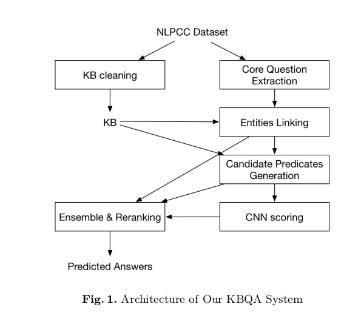

## Entity Linking

​       一个KB实体“李娜(跳水运动员)”是由实体名称“李娜”和实体解释“跳水运动员”(有时缺席)组成的。问题的主题实体是相应知识库查询的核心实体，实体提及是问题的子串，它包含主题实体。当且仅当提及与主题实体相同，或只是名称，或通信在提供的文件“nlpcc-iccpol 2016.kbqa.kb.mention2id”中提及时，实体提及包含一个主题实体。受[20]的启发，我们训练了一种基于特性的GBDT(gradient boost decision tree)来从所有可能的问题子串中选择提到的实体。

​     为了培养监督实体链接模型，黄金提到标签是先决条件。黄金提示必须包含一个与黄金答案相同的对象的KB实体。为了保证黄金标注的精度，采用了提及间的覆盖范围、提及长度和位置等多条规则，每个问题最多有一个黄金标注。统计结果见表1。人工检查，大多数被排除的候选提到是有缺陷的。

​    实体链接模型所采用的所有特性如下所示，类似于之前[20]的透水工作。但没有考虑词性信息，大部分特征都有多个角度。由于我们提到的是子字符串，而不是连续单词，而是汉字，因此使用FMM(前向最大匹配)查找下一个单词，使用RMM(反向最大匹配)查找最后一个单词。GBDT模型是针对gloden提到的基于这些特性的问题进行训练的。设置和结果在第4节中显示。

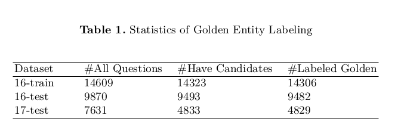

- 位置和长度。提字头、中间和尾的绝对和相对位置。提及的绝对长度和相对长度。提到的是不是一个单一的汉字。
- DF得分。所有问题中提到的字符串的IDF得分。根据wikipedia 1，我们使用4种方法计算IDF得分。
- 其他特性。提及中是否有中文，提及是否等同于实体名称，提及是否被其他提及所覆盖。

## Candidate Predicates Generation

​     我们使用与[19]相同的方法来评估问题模式的语义是否能覆盖谓词(参见eq 1)，但删除了大部分技巧，如问题分类和高频实体过滤。我们使用一种变体(见eq 2)来评价谓词的语义是否能覆盖问题模式，其中ave q是所有问题中单词的平均向量，用于匹配停止词。本节的分词方法与[19]相同。因此，所有疑问句和谓语中可能出现的词都会被考虑在内。关于该基于词向量的评价方法的详细说明以及对所选择的分词方法的讨论可以在[19]的3.2节中找到。

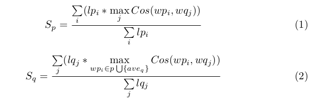

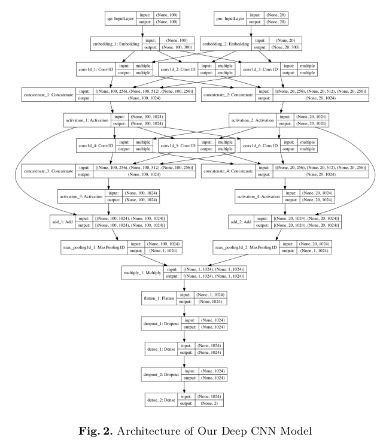

​     为了在重新排序过程中限制候选实体-谓词对的数量，我们使用这些特征的线性组合(参见eq 3)来过滤不太可能的候选，类似于之前的工作[19]。其中l men表示所提到的长度，l pre表示所提到的长度。如果一个实体涉及多个具有相同谓词的KB实体，则只考虑第一个实体的谓词(按KB文件中的外观排序)，因此不会生成重复的实体-谓词对。

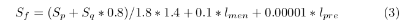

## Deep CNNs Architecture

​     采用深度卷积神经网络对候选实体谓词对进行重新排序。提交版本中使用的深度CNNs模型的详细架构如图2所示。该模型评估了预命题模式与问题模式的相似性，即未提及实体的问题。使用预先训练好的词向量来表示输入，然后是几个卷积块(图2中的2个卷积块)来生成高级特征。然后，在最大池化层之后，采用element-wise乘法来组合来自问题和谓词的特性。最后，使用带dropout的多层感知器来评估最终的相似度。卷积层的参数在谓词和问题的处理之间共享。

​     受GoogLeNet[16]的启发，在每个卷积块中有多个滤波器宽度(在图2中，256个宽度为1,512个宽度为2的滤波器，256个宽度为3的滤波器)，在ResNet[15]之后，相邻块之间存在残差连接。受更深的模型和计算能力带来的池改进的限制，提交版本只有2块.

## Ranking

​     采用所有中间分值的线性组合来生成候选答案的最终排名。自高精度实体连接(3.1节)和单一功能的良好的性能由深cnn(3.3节)或基于词向量的方法(3.2节),结合方程是非常粗略的不精细调整(见eq 4),男性,f,和S cnn实体提到分数,entity-predicate对基于词向量方法的评估,评估分别由cnn和谓词。

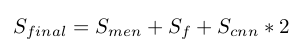

## Experiment

### Dataset

​     数据集由NLPCC 2017评估任务发布，包括一个知识库和用于训练和测试的问答对。知识中大约有4300万个SPO对，其中涉及约600万个主题、60万个谓词和1600万个对象。2017-训练集包含14,609对2016-训练试题-答案和9,870对2016-测试试题-答案。2017年测试集包含7631对问答。答案由人标记，大多数问题可以由KB对象回答。

### Settings

​      我们系统中的所有单词向量与之前的工作[19]中的单词向量列表相同，该工作使用了Tomas Mikolov 1生成的word2vector工具和在Baidubaike语库上训练的CBOW[17]模型。分词使用的词表由词向量表中的所有词组成。

​    GBDT实体链接模型中使用的参数为:max depth=8, eta=0.1, objective=reg:logistic, nrounds=100。在训练CNN模型时，batch size为64,loss function为binary crossentropy, optimizer为adadelta[23]。提交版本已经训练了21个epoch，但是相同设置下最好的f1得分出现在7个epoch完成时，达到47.35%。CNN模型由keras实现。

​    在实体链接过程中，只有排名前三且得分高于排名前三者意愿0.01倍的提及，这就是我们的提及过滤规则。只有前20个候选的实体-谓词对将被用于cnn。

   针对网络神经网络在训练时段性能不稳定的问题，提出了一种集成学习方法。S cnn是8个cnn输出的平均值。其中4个具有与图2相同的架构，其他的与图2相似，但在每个卷积块中都有384个宽度为1的过滤器和640个宽度为2的过滤器。所有的CNN模型在初始化时都有不同的种子.

   虽然在训练CNN模型之前，在生成候选谓词时，大部分的负实体-谓词对已经被过滤掉了，但是正样本和负样本的数量仍然是不平衡的。因此采用了动态负采样的方法。负的实体谓词对P ep i的可能性如eq 5所示，其中排名ep i是该实体谓词对在最后一次迭代结束时得分的问题的排名。它就像一个简单的生成对抗机制，其中生成模型是判别模型的最后一次迭代。

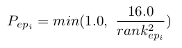

## Results

​      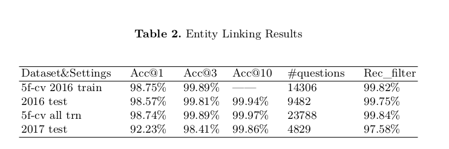

​      我们的实体链接模型的结果如表2所示。我们使用5倍交叉验证对2016年和2017年的训练数据集以及每个测试数据集与相应的训练数据进行测试。Rec_filter是提及过滤器规则的召回。与之前[20]的工作相比，在2016年的训练数据上，我们的模型的准确率(98.75%)略低于他们的he f1-score(99.04%)。但他们只标注了14033个问题，而我们标注了14306，数据中的每个问题都只有一个黄金提及。因此，哪一种模式更好还不是很明显。

​    候选谓词生成一些详细信息如表3所示，包括问题数量、每个问题提到的候选词数量和每个问题候选知识库三元组的数量。由于2017年测试数据中排名前一的实体链接的准确率降低，实体过滤器在每个问题中自动持有更多的实体提及。

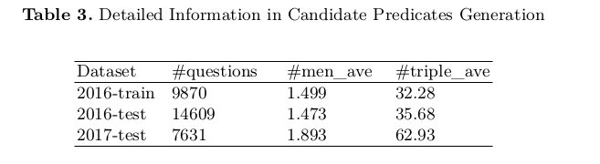

​     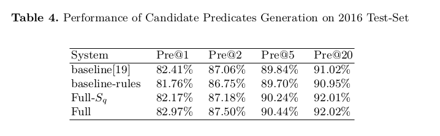

​          另外，基于词向量的方法在不同设置下对2016测试集的结果如表4所示。Baseline是NLPCC 2016 KBQA任务[19]中最好的系统。但是为了与我们的方法进行公正的比较，对于相同的实体-谓词对，只应答一个对象，因此top-n精度(n>1)将低于报告的精度。baseline -rules是一个没有问题分类和基于模式训练等技巧的基线系统，这是我们系统的实际基线。我们认为这些规则应该被CNNs自动总结出来。整个系统采用了实体链接过滤器和基于反向词向量的相似度查询。从表4可以看出，实体链接和反向相似度都可以提高性能，候选实体的限制可以大幅度提升pre@20，这是CNN重新排序的一个重要指标。

​    CNN对我们不同深度的CNN模型的2017测试集的结果重新排序如表5所示。+s f &s men代表ensemble CNNs和previous features的组合。每个块有1024个过滤器，如图2所示。似乎越深入越能带来不稳定的改善。由于计算能力的限制，我们不能很好地调整滤波器数量和块结构等参数。因此，深层架构仍有很大的潜力。我们提交架构中最好的pre@1是47.35%，它包含8个2块模型。在2017年测试集上，基于单词向量的特征s f可以达到43.10%，将渗透特征与cnn结合得到明显的提高。

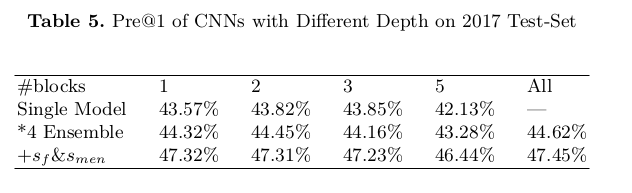

​      提交体系结构的详细结果如表6所示。CNN模型训练了2016年数据集的17个epoch和2017年数据集的7个epoch。根据[19]，如果通过找到正确的实体-谓词对来判断性能，基线系统在2016测试集上的准确率高达85.61%，而我们的系统在2016测试集上的准确率为89.65%。

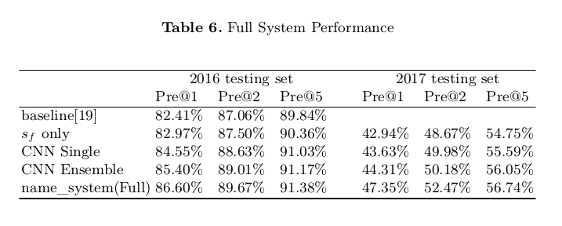

​      NLPCC2017评估任务提交结果如表7所示(14次提交的前5名结果)。我们的系统在所有团队中取得了最好的成绩。

## Upper Bound Analysis

​      测试数据集不是KB对象，其中14%的主题实体提到的是KB实体的别名，没有在文件“nlpcc-iccpol 2016.kbqa.kb中提及。mention2id”，使我们的实体喜欢方法与他们成为无效的。因此，别名链接也非常重要，除了给定的知识库之外，还需要更多的信息。

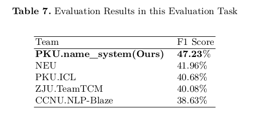

### Further Experiments

​    我们也在qald数据集2的一个子集上做了实验。由于qald中的训练数据对于深度CNN模型来说不够大，所以我们使用了仅限s f的设置，这是一种无监督的方法。从qord -6 task 1的训练集(包含350个问题的RDF数据上的多语言问题回答)中选出78个英语单关系factoid问题，系统能正确回答其中的82%(64/78)，说明语言不是系统的限制。

## Conclusion

​     本文提出了一个复杂的KBQA系统，该系统由基于特征的实体喜好、基于词向量的候选谓词生成和基于深度cnn的重排序方法组成，能够回答简单关系的中文问题。针对CNNs输入的不平衡，我们提出了一种生成的对抗方法，如负采样方法。我们的系统在NLPCC 2017共享任务5 (KBQA子任务)竞赛中获得第一名。文中还演示了详细的实验结果，这有助于其他开发人员理解我们的组件所做的贡献。在将来，我们将扩展我们的系统以回答多关系问题，并尝试组合来自知识库三元组对象的信息。

