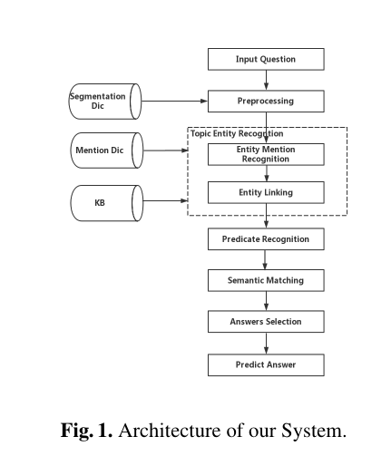
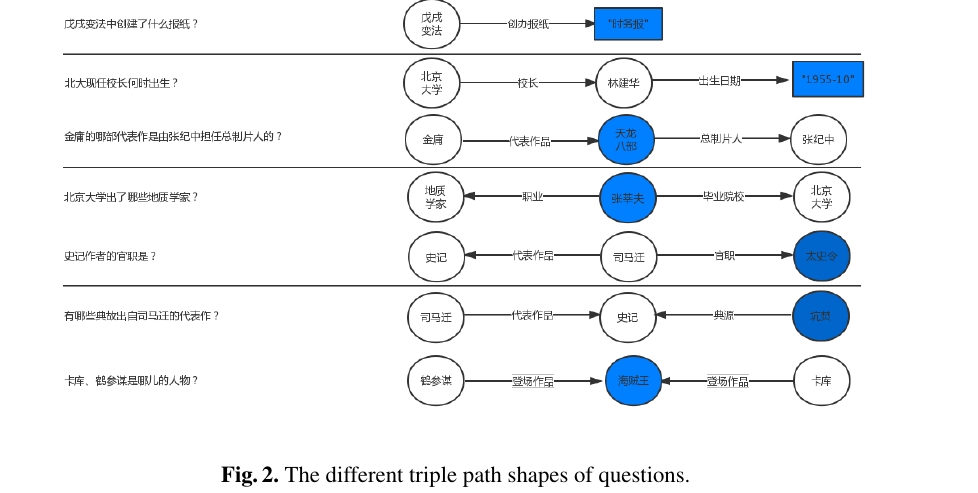
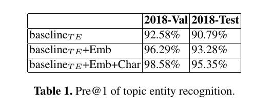
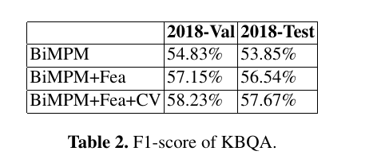

# A Joint Model of Entity Linking and Predicate Recognition for Knowledge Base Question Answering

## Abstract

　　在本paper中，构建了一个自动找到正确答案的问答系统, 第一步是为一个问题确定知识库中所有的实体.利用预测分数对主题实体的所有排序后三元组合进行logistic建模，第二步使用联合训练实体链接和谓词识别模型对问题的三元组进行重新排序．最后，利用规则匹配从三元组中选择答案。方法在测试数据上的平均f1分为57.67%，获得CCKS 2018 COQA任务竞赛的第二名。

## Introduction

　　本文首先是选择实体，然后选择one-hop 和 two-hop进行实体排序．然后使用语义匹配模型BiMPM[1]来训练一个用于实体链接和谓词识别的联合模型来对三元组进行重新排序。最后，基于规则匹配从三元组中选择答案。one-hop 和 two-hop三元组的问题占90.02%。因此，本文主要探讨这些问题。

## Related Work

　　KBQA是自然语言处理领域的一个重要课题。目前有两种主流方法:基于语义解析和基于检索。

　　语意解析首先解析问题的逻辑形式，该形式是一课语义树，组合的方式显式地表示问题的意义，根据知识库执行逻辑得到答案。这种方法的逻辑形式有助于理解问题的语义结构，也增加了这项任务的难度。Lai使用基于词嵌入的特征搜索最优的主语谓词对，并根据规则在NLPCC 2016 KBQA任务中获得第一名。Lai提出了一种新的基于深度cnn的方法来对由浅层特征生成的实体-谓词对进行重新排序。该方法在NLPCC 2017 KBQA任务竞赛中获得第一名。Hu提出了一种动态查询图匹配方法，从数据驱动的角度处理实体和关系的消歧任务。在我们的工作中，我们也使用了基于检索的方法。

## The Proposed System

  系统架构如图1所示。第一步是预处理，即对输入问题进行分词处理。然后根据预处理结果进行实体识别模块，然后对具有某些特征的三元组路径进行优先排序．

用BiMPM选择匹配的三元组路径。最后，从匹配的候选三元组路径中选择答案。

## Knowledge Base and Dictionary

​    知识库(KB)和实体提及字典 由CCKS提供, 此外，用于Hanlp构建了分割词典，以提高语分割和实体提及识别的结果。分割字典是由所有主题的KB，所有实体及其提到的字典。

## Topic Entity Recognition

　　如果问题分割的词在字典中，则该词属于实体。从某些特征来看，被识别的提及实体被提及的概率是不同的。我们系统中使用的特性定义如下：

- 有较长的字符串的实体更可能是主题实体，而不是较短的实体。
- 实体的TF值高词频(TF)值的实体比低词频(TF)值的实体成为主题实体的概率更低
- 实体与疑问词之间的距离靠近疑问词的问题中实体更可能是主题实体

　　最后一步所识别的连接实体提到的实体并不是实体知识库，所以这一步的目的是确定实体提及的身份问题。实体的关系和属性信息有助于实体链接，因此首先提取实体 two-hop，根据所选择的候选实体提取率，我们使用以下三个特征对匹配的主题实体进行排序和选择．

- 问题与候选实体的two-hop子图之间的重叠词越多，所提取的实体为主题实体的概率越大。
- 问题与候选实体的two-hop子图之间的相似度越大，所提取的实体为主题实体的概率越大。
- 问题和三元组路径的字符重叠特征是相似的。唯一的区别是该特性使用字符级而不是单词级。

在计算和正则化所有特征后，利用线性加权方法对候选实体进行排序。分数方程定义如下式，其中$w _i$表示特征$i$的权重。

${Score} _{tpicentity} = w _1 * F _1 + w _2 * F _2  + w _3 * F _3 + w _4 * F _ 4 + w _5 * F _5 + w _6 * F _6$

## Predicate Recognition

　　一个主题实体可以提取大约349.6条候选三元组路径。很难从如此多的候选三元组路径中选择最匹配的路径。缩小候选三元组路径是提高最终结果的重要步骤。在本模块中，我们首先提取关于三元组路径谓词的四个特性。然后利用logistic回归算法对具有以下四个特征和主题实体识别特征的候选三元组路径进行排序。最后，我们选择前10条三元组路径作为下一个语义匹配模块的候选路径。

- 疑问句和谓语之间的单词重叠 

  三元组路径的问题谓词与候选谓词之间共享的重叠词越多，候选谓词为真实谓词的概率越大。

- 疑问句与谓语之间的词嵌入相似性

  问题与候选谓词之间的相似性越大，候选谓词真正是谓词的可能性越大。

- 问题和谓词之间的字符重叠

  这个特性几乎与第一个相同。唯一的区别是这个特性使用char级而不是词水平

- 问题和谓词之间的字符嵌入相似性

  这个特性几乎与第二句相同。唯一的区别是该特性使用字符级而不是单词级。

## Semantic Matching

问题的形式化 

  这个模块的目标是从n个候选三元组路径{T P1, T P2，…Q是用户的问题。TPi是Q的候选三元组路径。在本文中，我们使用两两评分函数S(TPi,Q)对所有候选三元组路径进行评分和排序。在本文中，n为10。

BiMPM ＋Fea

  将单词嵌入和所有10个特性合并到BiMPM中，以选择最佳匹配的三元组路径。BiMPM+Fea包含5个内核层。

- 单词表示层:该层的目标是用d维向量表示每个有问题的单词和三重路径。将嵌入到论文中的单词用Gensim进行预训练，d为100。
- 上下文表示层:此层的目的是将上下文信息合并到问题和三元组路径的每个时间步骤的表示中。本文使用BiLSTM对每个时间步长进行上下文嵌入编码。
- 匹配层:这是核心层，用于获取问题与三元组路径在时间步长上的相似性。此外，匹配是双向的，即问题与三元组路径相互匹配，并分别从各自的匹配信息中获得匹配信息。
- 聚合层:将匹配信息的问题和三元组路径聚合为定长。聚合层由BiLSTM组成，我们使用最终的隐藏状态来表示聚合的信息。
- 特征聚合层:该层将最后一层的定长张量与我们提取的10个特征连接起来。

## Answers Selection

在语义匹配模块中选择匹配的三元组路径。然后规则生成答案。图2显示了我们的规则示例。图中圆形节点或矩形节点仅表示实体或属性值，不影响规则选择答案。蓝色结点就是答案。

One-hop 三元路径:　在这种情况下，答案是问题中没有出现的三元组路径的组件。

Two-hop 三元路径:　如果三元组路径中最右边的节点和最左边的节点都没有出现在问题中，那么中间的节点就是答案。如果最右边的节点或最左边的节点出现在问题中，那么另一个就是答案。

## Experiments and discussion

我们通过使用CCKS数据来评估我们的方法。该数据集由CCKS 2018评估任务发布，包括知识库、知识实体提取文件和用于训练、验证和测试的问答对。知识库有4100万三倍。2018-Train集、2018-Val集、2018-Test集分别包含1283,400,400个样本。在训练过程中，为了获得负样本，对于每个问题，我们选择前10个错误的候选三元路径。为了减轻训练数据不平衡的影响，我们对正样本进行过采样。

## Topic Entity Recognition Result

表1显示了主题实体识别模块的系统性能。基本型baselineT E只使用F1, F2, F3, F4。第二个模型是baselineT E +Emb，它也使用了嵌入特性F5。最后一个是baselineT E +Emb+Char，也使用了嵌入特性F5和Char级特性F6。从表1可以明显看出，嵌入特征F5和char级特征F6都可以提高主题实体识．超参数$w _i$为[0.25,0.37，-0.32,0.67,0.71,0.58]。

## BiMPM Re-ranking Result

表2显示了实验系统的性能, 基本模型BiMPM只使用预先训练好的字嵌入。第二个是BiMPM+Fea，它也使用了基于基线BiMPM提取的10个特征。最后一个是BiMPM+Fea+CV，它利用了基于BiMPM+Fea的10倍交叉验证。明显看出，提取的特征和交叉验证都可以提高f1得分.测试结果高出2.5%．原因是实体链接分数和预测识别分数对于三元组路径的预排序是有用的。

## Conclusion

一种用于KBQA的实体连接和谓词识别的联合模型。系统在CCKS 2018 COQA任务中，f1得分为57.67%。