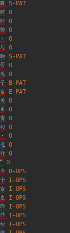

# 医疗命名实体识别

## 任务描述

​       实体识别作为信息抽取的一个重要子任务，近些年已经取得了阶段性成果。对于医学领域的自然语言文献，例如医学教材、医学百科、临床病例、医学期刊、入院记录、检验报告等，这些文本中蕴含大量医学专业知识和医学术语。将实体识别技术与医学专业领域结合，利用机器读取医学文本，可以显著提高临床科研的效率和质量，并且可服务于下游子任务。要想让机器“读懂”医学数据，核心在于让计算机在大量医学文本中准确的提取出关键信息，这就涉及到了命名实体识别、关系抽取等自然语言处理技术。医学领域中非结构化的文本，都是由中文自然语言句子或句子集合组成。实体抽取是从非结构化医学文本中找出医学实体，如疾病、症状的过程。

## 数据简介

> 原始数据


标记

> BIOES数据格式
>
> 标签列表如下：
>
> - B，即Begin，表示开始
> - I，即Intermediate，表示中间
> - E，即End，表示结尾
> - S，即Single，表示单个字符
> - O，即Other，表示其他，用于标记无关字符


| 分类实体 | 说明           |
| -------- | -------------- |
| PAT      | **临床表现**   |
| OPS      | **手术**       |
| DSE      | **疾病和诊断** |
| DRG      | **药物**       |
| INF      | **部位**       |
| LAB      | **生化指标**   |
| O        | **其他**       |

{'I-PAT', 'B-OPS', 'I-DSE', 'I-OPS', 'B-DSE', 'E-DSE', 'B-DRG', 'E-OPS', 'I-INF', 'S-PAT', 'I-DRG', 'I-LAB', 'E-LAB', 'O', 'B-PAT', 'B-LAB', 'E-DRG', 'S-LAB', 'E-INF', 'S-DSE', 'B-INF', 'E-PAT'}

##### 数据集描述

本次评测的训练数据有：
**1)** 1000条标注数据
**2)** 1000条非标注数据。
**3)** 7个类别

## 目标

1. 通过train数据中的标记实体信息, 抽取出test数据集中的数据, 记录ac, loss, 保存最佳的模型

## 项目结构

├── checkpoints　＃＃　模型保存文件
├── config.py　＃＃　配置文件
├── crf_predict.py　＃＃预测
├── crf.py ## ＣＲＦ模型
├── data ## 源数据
├── LICENSE
├── main.py  # 路口文件
├── model.py ## 模型
├── processed  ## 预处理数据
├── README.md
└── utils.py　＃＃　工具

## 数据预处理

- 价格原来BIOES的数据转成BIO结构

  


## 参数

```python
   parser = argparse.ArgumentParser()
    parser.add_argument("--batch_size", type=int, default=128) 
    parser.add_argument("--lr", type=float, default=0.0001)
    parser.add_argument("--n_epochs", type=int, default=30)
    parser.add_argument("--finetuning", dest="finetuning", action="store_true")
    parser.add_argument("--top_rnns", dest="top_rnns", action="store_true")
    parser.add_argument("--logdir", type=str, default="checkpoints/01")
    parser.add_argument("--trainset", type=str, default="processed/processed_training_bio.txt")
    parser.add_argument("--validset", type=str, default="processed/processed_dev_bio.txt")
    hp = parser.parse_args()
```


## 模型

> BILSTM(bidirectional=True, num_layers=2, input_size=768, hidden_size=768//2, batch_first=True) ## 双向，两层　
>
> BERT () # 中文bert预处理模型12层768hidden_size
>
> CRF

- 关于CRF 原理，请参照

## DATASET

- 最大长度　256
- CLS 开头　'[SEP]'　结尾

 sentence

'[CLS]', '，', '患', '者', '3', '月', '前', '因', '“', '直', '肠', '癌', '”', '于', '在', '我', '院', '于', '全', '麻', '上', '行', '直', '肠', '癌', '根', '治', '术', '（', 'D', 'I', 'X', 'O', 'N', '术', '）', '，', '手', '术', '过', '程', '顺', '利', '，', '术', '后', '给', '予', '抗', '感', '染', '及', '营', '养', '支', '持', '治', '疗', '，', '患', '者', '恢', '复', '好', '，', '切', '口', '愈', '合', '良', '好', '[SEP]'

tags

'[CLS]', 'O', 'O', 'O', 'O', 'O', 'O', 'O', 'O', 'B-DSE', 'I-DSE', 'I-DSE', 'O', 'O', 'O', 'O', 'O', 'O', 'O', 'O', 'O', 'O', 'B-OPS', 'I-OPS', 'I-OPS', 'I-OPS', 'I-OPS', 'I-OPS', 'I-OPS', 'I-OPS', 'I-OPS', 'I-OPS', 'I-OPS', 'I-OPS', 'I-OPS', 'I-OPS', 'O', 'O', 'O', 'O', 'O', 'O', 'O', 'O', 'O', 'O', 'O', 'O', 'O', 'O', 'O', 'O', 'O', 'O', 'O', 'O', 'O', 'O', 'O', 'O', 'O', 'O', 'O', 'O', 'O', 'O', 'O', 'O', 'O', 'O', 'O', '[SEP]'

## 定义主模型

```python
class Bert_BiLSTM_CRF(nn.Module):
    def __init__(self, tag_to_ix, hidden_dim=768):
        super(Bert_BiLSTM_CRF, self).__init__()
        self.tag_to_ix = tag_to_ix
        self.tagset_size = len(tag_to_ix)
        # self.hidden = self.init_hidden()
        self.lstm = nn.LSTM(bidirectional=True, num_layers=2, input_size=768, hidden_size=hidden_dim//2, batch_first=True)
        self.transitions = nn.Parameter(torch.randn(self.tagset_size, self.tagset_size))
        self.hidden_dim = hidden_dim
        self.start_label_id = self.tag_to_ix['[CLS]']
        self.end_label_id = self.tag_to_ix['[SEP]']
        self.fc = nn.Linear(hidden_dim, self.tagset_size)
        self.bert = BertModel.from_pretrained('/home/daiyizheng/.cache/torch/transformers/bert-pretrainmodel/bert/bert-base-chinese')
        # self.bert.eval()  # 知用来取bert embedding
        
        self.transitions.data[self.start_label_id, :] = -10000
        self.transitions.data[:, self.end_label_id] = -10000
        self.device = torch.device('cuda') if torch.cuda.is_available() else torch.device('cpu')
        # self.transitions.to(self.device)
        


    def init_hidden(self):
        """
        初始化LSTM隐层
        :return:
        """
        return (torch.randn(2, 1, self.hidden_dim // 2),
                torch.randn(2, 1, self.hidden_dim // 2))


    def _forward_alg(self, feats):
        '''
        this also called alpha-recursion or forward recursion, to calculate log_prob of all barX 
        '''
        
        # T = self.max_seq_length
        T = feats.shape[1]  
        batch_size = feats.shape[0]
        
        # alpha_recursion,forward, alpha(zt)=p(zt,bar_x_1:t)
        log_alpha = torch.Tensor(batch_size, 1, self.tagset_size).fill_(-10000.).to(self.device)  #[batch_size, 1, 16]
        # normal_alpha_0 : alpha[0]=Ot[0]*self.PIs
        # self.start_label has all of the score. it is log,0 is p=1
        log_alpha[:, 0, self.start_label_id] = 0
        
        # feats: sentances -> word embedding -> lstm -> MLP -> feats
        # feats is the probability of emission, feat.shape=(1,tag_size)
        for t in range(1, T):
            log_alpha = (log_sum_exp_batch(self.transitions + log_alpha, axis=-1) + feats[:, t]).unsqueeze(1)

        # log_prob of all barX
        log_prob_all_barX = log_sum_exp_batch(log_alpha)
        return log_prob_all_barX

        
    def _score_sentence(self, feats, label_ids):
        T = feats.shape[1]
        batch_size = feats.shape[0]

        batch_transitions = self.transitions.expand(batch_size,self.tagset_size,self.tagset_size)
        batch_transitions = batch_transitions.flatten(1)

        score = torch.zeros((feats.shape[0],1)).to(self.device)
        # the 0th node is start_label->start_word,the probability of them=1. so t begin with 1.
        for t in range(1, T):
            score = score + batch_transitions.gather(-1, (label_ids[:, t]*self.tagset_size+label_ids[:, t-1]).view(-1,1)) + feats[:, t].gather(-1, label_ids[:, t].view(-1,1)).view(-1,1)
        return score

    def _bert_enc(self, x):
        """
        x: [batchsize, sent_len]
        enc: [batch_size, sent_len, 768]
        """
        with torch.no_grad():
            encoded_layer, _  = self.bert(x)
            enc = encoded_layer[-1]
        return enc

    def _viterbi_decode(self, feats):
        '''
        Max-Product Algorithm or viterbi algorithm, argmax(p(z_0:t|x_0:t))
        '''
        
        # T = self.max_seq_length
        T = feats.shape[1]
        batch_size = feats.shape[0]

        # batch_transitions=self.transitions.expand(batch_size,self.tagset_size,self.tagset_size)

        log_delta = torch.Tensor(batch_size, 1, self.tagset_size).fill_(-10000.).to(self.device)
        log_delta[:, 0, self.start_label_id] = 0.
        
        # psi is for the vaule of the last latent that make P(this_latent) maximum.
        psi = torch.zeros((batch_size, T, self.tagset_size), dtype=torch.long)  # psi[0]=0000 useless
        for t in range(1, T):
            # delta[t][k]=max_z1:t-1( p(x1,x2,...,xt,z1,z2,...,zt-1,zt=k|theta) )
            # delta[t] is the max prob of the path from  z_t-1 to z_t[k]
            log_delta, psi[:, t] = torch.max(self.transitions + log_delta, -1)
            # psi[t][k]=argmax_z1:t-1( p(x1,x2,...,xt,z1,z2,...,zt-1,zt=k|theta) )
            # psi[t][k] is the path choosed from z_t-1 to z_t[k],the value is the z_state(is k) index of z_t-1
            log_delta = (log_delta + feats[:, t]).unsqueeze(1)

        # trace back
        path = torch.zeros((batch_size, T), dtype=torch.long)

        # max p(z1:t,all_x|theta)
        max_logLL_allz_allx, path[:, -1] = torch.max(log_delta.squeeze(), -1)

        for t in range(T-2, -1, -1):
            # choose the state of z_t according the state choosed of z_t+1.
            path[:, t] = psi[:, t+1].gather(-1,path[:, t+1].view(-1,1)).squeeze()

        return max_logLL_allz_allx, path


    def neg_log_likelihood(self, sentence, tags):
        feats = self._get_lstm_features(sentence)  #[batch_size, max_len, 16]
        forward_score = self._forward_alg(feats)
        gold_score = self._score_sentence(feats, tags)
        return torch.mean(forward_score - gold_score)


    def _get_lstm_features(self, sentence):
        """sentence is the ids"""
        # self.hidden = self.init_hidden()
        embeds = self._bert_enc(sentence)  # [8, 75, 768]
        # 过lstm
        enc, _ = self.lstm(embeds)
        lstm_feats = self.fc(enc)
        return lstm_feats  # [8, 75, 16]

    def forward(self, sentence):  # dont confuse this with _forward_alg above.
        # Get the emission scores from the BiLSTM
        lstm_feats = self._get_lstm_features(sentence)  # [8, 180,768]

        # Find the best path, given the features.
        score, tag_seq = self._viterbi_decode(lstm_feats)
        return score, tag_seq
```


## 训练结果

> num_proposed:46616
> num_correct:38213
> num_gold:46865
> precision=0.82
> recall=0.82
> f1=0.82

## 