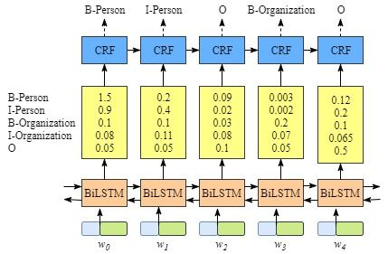

# CRF

## CRF 能做什么

​     CRF是这样的一个模型。我们这里只讨论Linear Chain CRF模型，不涉及更general的CRF模型。大部分时候同学们能够接触到的CRF模型都是Linear Chain CRF。是一个序列化标注算法（sequence labeling algorithm），接收一个输入序列如 $X = (x _1, x _2,.... x _n)$ 并且输出目标序列$Y = (y _1, y _2,.... y _n)$ 。

## CRF与其他

隐马尔可夫模型（Hidden Markov Model，HMM），最大熵马尔可夫模型（Maximum Entropy Markov Model，MEMM）以及条件随机场（Conditional Random Field，CRF）是序列标注中最常用也是最基本的三个模型。

HMM首先出现，MEMM其次，CRF最后。三个算法主要思想如下：

1）HMM模型是对转移概率和表现概率直接建模，统计共现概率，HMM就是典型的概率有向图，其就是概率有向图的计算概率方式。

2）MEMM模型是对转移概率和表现概率建立联合概率，统计时统计的是条件概率，但MEMM容易陷入局部最优，是因为MEMM只在局部做归一化。

3）CRF模型中，统计了全局概率，在 做归一化时，考虑了数据在全局的分布，而不是仅仅在局部归一化，这样就解决了MEMM中的标记偏置（label bias）的问题。

**本质上，CRF有以下三个优点：**

1）与HMM比较，CRF没有HMM那样严格的独立性假设条件，因而可以容纳任意的上下文信息。特征设计灵活（与ME一样） 

2）与与MEMM比较，由于CRF计算全局最优输出节点的条件概率，它还克服了最大熵马尔可夫模型标记偏置（Label-bias）的缺点。 ­­

3）CRF是在给定需要标记的观察序列的**条件下**，计算整个标记序列的联合概率分布，而不是在给定当前状态条件下，定义下一个状态的状态分布。凡事都有两面，正由于这些优点，CRF需要训练的参数更多，与MEMM和HMM相比，它存在训练代价大、复杂度高的缺点。 

## 适用场景

​      目前序列标注的使用方法: HMM、CRF、LSTM/Bi-LSTM、LSTM/Bi-LSTM+CRF

​      采用Bi-LSTM+CRF就是结合了Bi-LSTM的特征表达能力与CRF的无向图生成模型的优点，成为经典就是必然。其典型架构如下图：

   

 注：在Bi-LSTM+CRF架构中，CRF最终的计算基于状态转移概率矩阵和发射概率矩阵(均指非归一化概率)。而Bi-LSTM的输出就充当了上述发射概率矩阵的角色。

## 原理解析

​       直接利用LSTM进行序列标注。但是这样的做法有一个问题：**每个时刻的输出没有考虑上一时刻的输出。**以“我 喜欢 跑步”为例，LSTM输出“喜欢”的标签是“动词”，而“跑步”的标签可能也是“动词”。但是实际上，“名词”标签更为合适，因为“跑步”这里是一项运动。也就是“动词”+“名词”这个规则并没有被LSTM模型捕捉到。也就是说这样使用LSTM**无法对标签转移关系进行建模**。**CRF有两类特征函数，一类是针对观测序列与状态的对应关系（如“我”一般是“名词”），一类是针对状态间关系（如“动词”后一般跟“名词”）。在LSTM+CRF模型中，前一类特征函数的输出由LSTM的输出替代，后一类特征函数就变成了标签转移矩阵**。

##  标签的score和损失函数的定义

Bi-LSTM 最后输出一般是［batch_size,seq_len, target_size］，target_size相当于是每个词映射到tag的发射概率值，设Bi-LSTM的输出矩阵为${P} _{ij}$代表词$w _i$映射到$tag _j$的非归一化概率。对于CRF来说，我们假定存在一个转移矩阵${A} _{ij}$，代表$tag _i$转移到$tag _j$的转移概率。 对于输入序列 **X** 对应的输出tag序列 y，定义分数为

$s(X, y) = {\sum} ^{n} _{i=0}{A} _{ {y} _{i+1} , y _i} + {\sum} ^{n} _{i=0}{P} _{i, y _i}$

利用Softmax函数，我们为每一个正确的tag序列y定义一个概率值（$\widetilde { Y } $代表所有的tag序列，包括不可能出现的）

$P(y|X) = \frac { {e} ^{s(X, y)} }{ {\sum} _{\widetilde { Y } \in {Y} _{X}}{ {e} ^{s(X, \widetilde { Y })} } } $


因而在训练中，我们只需要最大化似然概率p(y|X)即可，这里我们利用对数似然

$log(p(y|X)) = log(\frac { {e} ^{s(X, y)} }{ {\sum} _{\widetilde { Y } \in {Y} _{X}}{ {e} ^{s(X, \widetilde { Y })} } }) = S(X, y) - log({ {\sum} _{\widetilde { Y } \in {Y} _{X}}{ {e} ^{s(X, \widetilde { Y })} } })$


所以我们将损失函数定义为-log(p(y|X))，就可以利用梯度下降法来进行网络的学习了。 **loss function:**

$Loss = log({ {\sum} _{\widetilde { Y } \in {Y} _{X}}{ {e} ^{s(X, \widetilde { Y })} } })　- S(X, y)$

在对损失函数进行计算的时候，S(X,y)的计算很简单，而

$log({ {\sum} _{\widetilde { Y } \in {Y} _{X}}{ {e} ^{s(X, \widetilde { Y })}}})$

（下面记作logsumexp）的计算稍微复杂一些，因为需要计算每一条可能路径的分数。这里用一种简便的方法，对于到词${w} _{i+1}$的路径，可以先把到词$w _i$的logsumexp计算出来，因为

$log({\sum} _{e}^{log({\sum}{e} ^{x} )+ y})  = log({\sum} {\sum} {e} ^{x+y})$

因此先计算每一步的路径分数和直接计算全局分数相同，但这样可以大大减少计算的时间。

我们进一步简化

$Z(X, y) = {e} ^{s(X, \widetilde { Y })}$

> 其中的logsumexp是各种科学运算库（numpy, pytorch）中都会提供的基本运算。
>
> $log{\sum} _{i} {e} ^{Z(X, y)} = max _i {Z _i} + log ({\sum} _{i}{e (Z _i - max _i (Z _i))})$

## [Pytorch 官方代码解析](https://pytorch.org/tutorials/beginner/nlp/advanced_tutorial.html?highlight=crf)

```python
import torch
import torch.autograd as autograd
import torch.nn as nn
import torch.optim as optim

torch.manual_seed(1)


def argmax(vec):
    # return the argmax as a python int
    _, idx = torch.max(vec, 1)
    return idx.item()


def prepare_sequence(seq, to_ix):
    idxs = [to_ix[w] for w in seq]
    return torch.tensor(idxs, dtype=torch.long)


# TODO 以一种数值稳定性算法求log_sum_exp: 先标准化，取出行中最大值进行broadcast，让每个元素减去最大值后求exp然后再求和
def log_sum_exp(vec): ## z(x) -> log(∑_i exp(z_i)) =  max_i(z_i) + log(∑_i)exp(z_i - max_i(z_i))
    max_score = vec[0, argmax(vec)]
    max_score_broadcast = max_score.view(1, -1).expand(1, vec.size()[1])
    return max_score + torch.log(torch.sum(torch.exp(vec - max_score_broadcast)))


class BiLSTM_CRF(nn.Module):

    def __init__(self, vocab_size, tag_to_ix, embedding_dim, hidden_dim):
        super(BiLSTM_CRF, self).__init__()
        self.embedding_dim = embedding_dim
        self.hidden_dim = hidden_dim
        self.vocab_size = vocab_size
        self.tag_to_ix = tag_to_ix
        self.tagset_size = len(tag_to_ix)  # tag_size : 3 + 2
        self.word_embeds = nn.Embedding(vocab_size, embedding_dim)
        self.lstm = nn.LSTM(embedding_dim, hidden_dim // 2, num_layers=1, bidirectional=True)

        # TODO 把LSTM 输出映射到状态空间（tag space）
        self.hidden2tag = nn.Linear(hidden_dim, self.tagset_size)

        # TODO 状态转移矩阵参数:T(i,j)表示从状态 j 转移到状态 i 的概率，这样第i行就是所有状态转移到状态i的概率
        self.transitions = nn.Parameter(torch.randn(self.tagset_size, self.tagset_size))

        # TODO 根据上面矩阵元素定义：限制不能从其他状态转移到起始状态，不能从结束状态转移到其他任何状态
        self.transitions.data[tag_to_ix[START_TAG], :] = -10000
        self.transitions.data[:, tag_to_ix[STOP_TAG]] = -10000
        self.hidden = self.init_hidden()

    def forward(self, sentence):  # dont confuse this with _forward_alg above.
        # Get the emission scores from the BiLSTM
        lstm_feats = self._get_lstm_features(sentence)

        # Find the best path, given the features.
        score, tag_seq = self._viterbi_decode(lstm_feats)
        return score, tag_seq

    def init_hidden(self):
        return (torch.randn(2, 1, self.hidden_dim // 2),
                torch.randn(2, 1, self.hidden_dim // 2))

    '''
        _forward_alg求出的是损失函数的log-sum-exp这一项，另一项比较简单
        因为计算误差score需要计算每一条可能路径的分数。这里用一种简便的方法，对于到词w_(i+1)的路径，
        可以先把到词w_i的log-sum-exp计算出来，然后累加，类似递推的思想
    '''

    def _forward_alg(self, feats):
        init_alphas = torch.full((1, self.tagset_size), -10000.)
        # TODO 起始状态score定义为0
        init_alphas[0][self.tag_to_ix[START_TAG]] = 0.
        forward_var = init_alphas

        # TODO 依次遍历句子中的所有词
        # feats : (seq_len,tag_size) LSTM映射到tag space的结果
        for feat in feats:
            ## TODO 句子中没有cls sep或者start end
            alphas_t = []  # 当前时间步的forward tensor
            for next_tag in range(self.tagset_size):  # TODO 遍历当前时间步(word)的所有可能状态
                # TODO 广播当前状态值为tag_size大小，用于和转移到当前时间步的那些状态操作，即 transiton[next_tag]
                emit_score = feat[next_tag].view(1, -1).expand(1, self.tagset_size)
                # TODO 其他状态转移到next_tag（当前状态）的概率
                trans_score = self.transitions[next_tag].view(1, -1)
                # TODO next_tag_var[i] 是 计算log-sum-exp 之前 状态 i -> 到状态 next_tag 值
                next_tag_var = forward_var + trans_score + emit_score
                alphas_t.append(log_sum_exp(next_tag_var).view(1))  # view(1) 把scalar变为[scalar]
            # TODO 此时 forward_var:size (1，tag_size) 作为下一个词word_(i+1)的初始值
            forward_var = torch.cat(alphas_t).view(1, -1)
        # TODO 最优加上所有状态转移到结束状态的值
        terminal_var = forward_var + self.transitions[self.tag_to_ix[STOP_TAG]]
        # TODO 求出最终log-sum-exp值
        alpha = log_sum_exp(terminal_var)
        return alpha

    def _get_lstm_features(self, sentence):
        self.hidden = self.init_hidden()
        # self.word_embeds(sentence).shape : (seq_len,voca_size)
        embeds = self.word_embeds(sentence).view(len(sentence), 1, -1)  # seq_len x batch_size x voca_size
        lstm_out, self.hidden = self.lstm(embeds, self.hidden)
        lstm_out = lstm_out.view(len(sentence), self.hidden_dim) #[seq_len, batch_size, hiidden_size]
        lstm_feats = self.hidden2tag(lstm_out)
        return lstm_feats

    '''
        这里求出损失函数另一项
    '''

    def _score_sentence(self, feats, tags):
        # Gives the score of a provided tag sequence
        score = torch.zeros(1)
        # TODO 加上起始状态
        tags = torch.cat([torch.tensor([self.tag_to_ix[START_TAG]], dtype=torch.long), tags])
        # TODO 根据损失函数定义 transitions[tags[i + 1], tags[i]] 表示从 状态i到状态(i+1)的概率
        # TODO feat[tag[i]] 表示 word[i] 到 tag[i] 的发射概率，这里用 tag[i+1] 因为前面填充了起始状态，
        for i, feat in enumerate(feats):
            score = score + self.transitions[tags[i+1], tags[i]] + feat[tags[i + 1]]
        score = score + self.transitions[self.tag_to_ix[STOP_TAG], tags[-1]]
        return score

    def _viterbi_decode(self, feats):
        backpointers = []

        # Initialieze the viterbi variables in log spac
        init_vvars = torch.full((1, self.tagset_size), -10000.)
        init_vvars[0][self.tag_to_ix[START_TAG]] = 0

        # forward_var at step i holds the viterbi variables for step i-1
        forward_var = init_vvars
        for feat in feats:
            bptrs_t = []  # holds the backpointers for this step
            viterbivars_t = []  # holds the viterbi variables for this step

            for next_tag in range(self.tagset_size):
                # next_tag_var[i] holds the viterbi variable for tag i at the
                # previous step, plus the score of transitioning
                # from tag i to next_tag.
                # We don't include the emission scores here because the max
                # does not depend on them (we add them in below)
                next_tag_var = forward_var + self.transitions[next_tag]
                best_tag_id = argmax(next_tag_var)
                bptrs_t.append(best_tag_id)
                viterbivars_t.append(next_tag_var[0][best_tag_id].view(1))
            # Now add in the emission scores, and assign forward_var to the set
            # of viterbi variables we just computed
            forward_var = (torch.cat(viterbivars_t) + feat).view(1, -1)
            backpointers.append(bptrs_t)

        # Transition to STOP_TAG
        terminal_var = forward_var + self.transitions[self.tag_to_ix[STOP_TAG]]
        best_tag_id = argmax(terminal_var)
        # TODO 到达STOP_TAG最大的分数
        path_score = terminal_var[0][best_tag_id]

        # Follow the back pointers to decode the best path.
        best_path = [best_tag_id]
        for bptrs_t in reversed(backpointers):
            best_tag_id = bptrs_t[best_tag_id]
            best_path.append(best_tag_id)
        # Pop off the start tag (we dont want to return that to the caller)
        start = best_path.pop()
        assert start == self.tag_to_ix[START_TAG]  # Sanity check
        best_path.reverse()
        return path_score, best_path

    def neg_log_likelihood(self, sentence, tags):
        feats = self._get_lstm_features(sentence)  # size : (seq_len,tag_size)
        forward_score = self._forward_alg(feats)
        gold_score = self._score_sentence(feats, tags)
        return forward_score - gold_score


START_TAG = "<START>"
STOP_TAG = "<STOP>"
EMBEDDING_DIM = 5
HIDDEN_DIM = 4

# Make up some training data
training_data = [(
    "the wall street journal reported today that apple corporation made money".split(),
    "B I I I O O O B I O O".split()
), (
    "georgia tech is a university in georgia".split(),
    "B I O O O O B".split()
)]

word_to_ix = {}
for sentence, tags in training_data:
    for word in sentence:
        if word not in word_to_ix:
            word_to_ix[word] = len(word_to_ix)

tag_to_ix = {"B": 0, "I": 1, "O": 2, START_TAG: 3, STOP_TAG: 4}
ix_to_tag = {}
for k, v in tag_to_ix.items():
    ix_to_tag[v] = k
model = BiLSTM_CRF(len(word_to_ix), tag_to_ix, EMBEDDING_DIM, HIDDEN_DIM)
optimizer = optim.SGD(model.parameters(), lr=0.01, weight_decay=1e-4)

# # Check predictions before training
# with torch.no_grad():
#     precheck_sent = prepare_sequence(training_data[0][0], word_to_ix)
#     precheck_tags = torch.tensor([tag_to_ix[t] for t in training_data[0][1]], dtype=torch.long)
#     # print(model(precheck_sent))

# Make sure prepare_sequence from earlier in the LSTM section is loaded
for epoch in range(300):  # again, normally you would NOT do 300 epochs, it is toy data
    for sentence, tags in training_data:
        # Step 1. Remember that Pytorch accumulates gradients.
        # We need to clear them out before each instance
        model.zero_grad()

        # Step 2. Get our inputs ready for the network, that is,
        # turn them into Tensors of word indices.
        sentence_in = prepare_sequence(sentence, word_to_ix)
        targets = torch.tensor([tag_to_ix[t] for t in tags], dtype=torch.long)

        # Step 3. Run our forward pass.
        # TODO 这里区别于一般的训练模型，一般模型是从forward的输出用于计算误差
        # TODO 而这里因为加上了CRF模型，在neg_log_likelihood定义了CRF误差用于梯度更新
        loss = model.neg_log_likelihood(sentence_in, targets)

        # Step 4. Compute the loss, gradients, and update the parameters by
        # calling optimizer.step()
        loss.backward()
        optimizer.step()
```


## viterbi 解码

具体请参考　

## 参考

[参考１](https://zhuanlan.zhihu.com/p/59845590)

[参考公式](https://www.seoxiehui.cn/article-215601-1.html)

