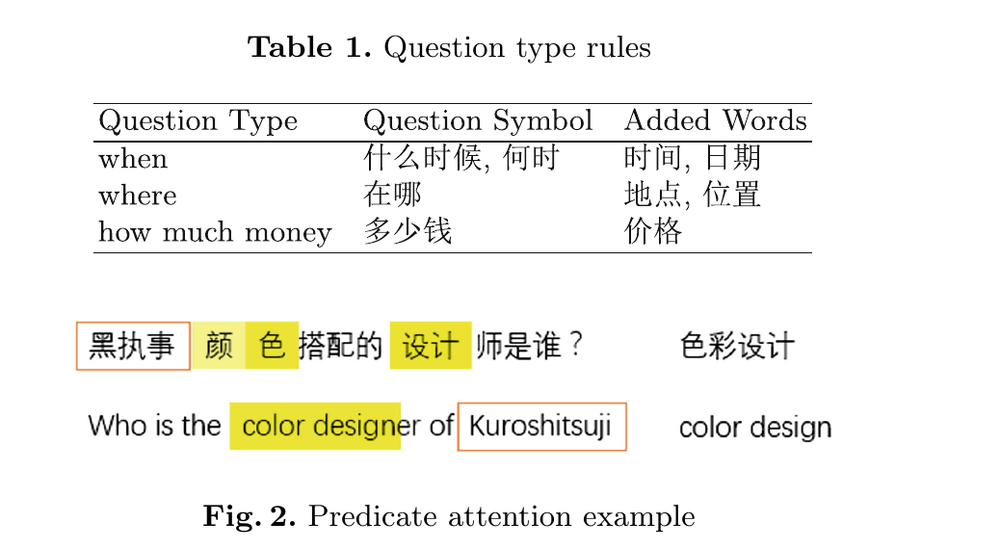

# Open Domain Question Answering System Based on Knowledge Base

## 摘要

　　

　　针对NLP&CC 2016中基于知识库的开放域问题回答任务，论文提出了SEP算法，自动从一个简单问句中提取主语谓语词对，将其翻译成知识库查询。提出了一种基于词向量相似度和谓词注意度的候选谓词评分方法。在NLP&CC 2016(KBQA子任务)竞赛中获得第一名，测试数据f1分82.47%。此外，还进行了一系列的实验和全面的误差分析，以显示新数据集的性质和缺陷。

##  Introduction

​         开放域问题回答(QA)是一个重要而又具有挑战性的问题，在很大程度上仍未解决。近年来，出版了大量的英文QA著作。但我们所知,KBQA(基于知识库的问答)数据集2016年NLP&CC评估任务是中国第一个大规模KBQA数据集。在本文中,我们在中国数据集集中精力回答单一关系似是而非的问题。一个SPE算法KB querie翻译一个中文的问题。该算法在逻辑上解决了多个关联问题，该问题可以表示为一个主题实体，并由谓词链连接。但受限于数据集，我们没有进行相关实验。

　　候选谓词评价是该算法的重要组成部分，提出了一种基于词向量相似度和谓词注意的新方法。在某种程度上，这种方法看起来像一个带有注意机制的神经网络，但它是如此浅显，以至于除了单词向量之外不需要训练任何参数。因此，它更简洁、高效、可解释性强，可以更灵活地与先验知识结合，但丧失了深度神经网络较强的表征能力等优点。还有尝试处理由spider、问题分类和训练数据引起的知识库错误，以提高性能。我们的方法测试数据f1得分为82.47%，在评估任务中获得第一名。

##  Related Work

​      KBQA的大多数方法都是基于一些解析方法，如语义解析、依赖解析和CCG(组合类别语法)，将问题映射到它的语义表示(例如一阶逻辑形式)。但是这些工作很少使用KBs来帮助进行解析，而且它们受到解析方法准确性的限制，在处理中文时尤其严重。为了避免这些缺点，一些方法借助知识库从问题中提取知识库查询，如最近的WebQuestions研究。

## Architecture

   

​      使用一个简单的主题实体链接方法来提取可能的KB实体。根据词向量相似度和谓词注意度对这些实体后的所有谓词进行评估。利用实体长度和谓词得分的线性组合对主谓对进行排序，利用训练集中从问题-答案对中提取的答案模式和处理备选问题的先验规则进行排序。

##  Topic Entity Linking

​      

​       问题的主题实体是相应KB查询的核心实体。在我们的系统中，所有以KB表示的实体(它们是问题的子字符串，不被其他实体重叠)都被视为潜在的主题实体。还有一个由高频实体组成的停止词列表，以减少噪音实体(如"is||是"，＂什么||what＂)和提高效率。在排序阶段，考虑实体的长度作为一个特征。

​      例如，问题的潜在主题实体 "做铁板鱼要用到什么调料？|| What sauce will be used when you make iron fish (Chinese cuisine)?"  是　＂铁板鱼|| iron fish＂, "到||to" 和　"调料|| sauce". "做||make", "要||will", "用||use", "哪 and些"（"哪些"　mean "What"）  被忽略，因为它们是高频实体。

## Predicate Scoring

​      主题实体链接之后，有一些潜在的实体，并且每个实体都有一些KB中的谓词。一个好的谓词可以完美地处理问题其余部分的语义。则候选谓词的分数为:

​       　 其中$wp _i$是谓语的第i个词，$wq _j$是问题的第j个词。$lp _i$是$wp _i$的长度。$Sim$为两个词的语义相似度，这里采用词向量的余弦相似度。此分数将用于排名阶段。

​      　语义相似性被认为是表征谓语词对有问题词的关注程度。如果p_i与qj1的相似性大于pi与qj2的相似性，则qj1涉及的pi语义较多。由于在评价每个谓词词时只考虑一个问题词，因此注意类似于加权对齐过程。最关心的疑问词构成了整个谓语的注意。以谓词词的长度作为权重，对词的相似性进行加权平均，衡量谓词是否适合于此问题。

​     　全细分模式的性能优于常规模式，但仍明显低于我们的细分模式。此外，助词和标点符号在这里被忽略，因为它们没有意义。

　　分词性能更好有两个原因。首先，在汉语中，如果一个词覆盖另一个词，它们通常有相似的语义，特别是在口语中。其次，词与词之间往往存在一种“类”的关系．因此，该分词器可以处理口语中灵活多变的词汇。

　　使用词向量计算语义相似度在处理疑问句时存在困难。     “s什么时候||when”与“日期||date”，"在哪 里||where" and "地点||place"之间的余弦相似度远低于预期。因此，我们使用一些手写的模式来指出问题类型，并直接在分词结果中加入一些符号词。由于语句非常灵活，只处理了3种类型的问题(表1)，占所有问题的10%左右。这只是将谓词评分与一些先前的规则组合在一起的一个小尝试，有很大的改进空间。

谓词注意的实例如图2所示，余弦相似度和映射关系如表2所示。

## Answer Pattern

​         答案模式是从标记的问题-答案对中提取的规则，可以揭示问题陈述与对应正确答案的知识库结构之间的联系。对于每个问题-答案对，候选三元组是KB中的SPO(主题-谓词-对象)三元组，其主题是问题的子字符串，而对象与答案相同。使用几个简单的规则来过滤高可信度三元组(主要基于匹配的长度)。还有一些情况是，没有候选三元组，为了确保最佳三元组的高精度，忽略这些问题-答案对。

​         答案模式提取示例如表3所示。

## Ranking

​       在排序阶段，利用实体长度、谓词得分和答案模式出现次数等特征的线性组合来选择黄金答案。

​       可以在这里添加一些规则来处理不适合此体系结构的问题。例如，可选问题几乎不涉及谓词的意义，只有有限的对象可供选择。

## Experiment

### Dataset

数据集由NLP&CC2016评估任务发布，包括一个知识库和用于训练和测试的问题答案对.

##  Experiment Settings

​       在主题实体链接过程中，在训练题和测试题中出现超过150次的实体被视为停止词。在24,479个问题中，有52,916个不同的实体，只有496个高频率实体，不足总数的1%。

​     使用word2vec软件生成单词向量。采用CBOW模型。窗口大小为5，向量维数为300，对频繁词的降采样阈值为20。以百度百科中的句子作为训练数据，生成155,837个词向量.

设r为谓词分数与实体长度之间的权重比率。测试r (fixed w_el = 1, w_po = 100)对训练集的影响，结果如图3所示。当r在10到16之间时，性能是最佳，因此我们设置r = 10，这意味着w_ps = 10。

## Benchmark Systems

三个基准测试系统

- KBQA任务的正式基准系统。所以我们就叫它NLPCC
- “模式匹配”，它只使用从训练数据中提取的答案模式来回答问题。保留核心问题提取，提高命中率。这个基测试的精度系统可以被视为在训练数据标记为答案的性能,这也是一种上界的这个数据集。
- 发现最长的主谓对问题和相应的对象被认为是答案,这是下界的准确性所有SPE的算法。

##  Results

系统与一些基准测试系统进行比较 如表4所示。

​        那么准确率@ n等于准确率@ n乘以回答率。“PatternMatch+NaiveSearch”是这两种系统的结合，直接将答案分数相加。

​        我们的系统的精确度@1接近于模式匹配和NaiveSearch系统的精确度@1，这两个系统是基于强规则的系统，精度高，召回率低，这意味着我们的系统在这个数据集上接近于理论上最好的系统。

​    我们还测试了系统核心的性能以及规则部分的影响，如表5所示。由于所有系统都打印有序答案而不是并行答案，所以最佳策略是选择第一个答案，因此F1平均分等于accuracy@1。因为所有这些测试的“回答”率都是100%，所以我们在这里用accuracy@N代替precision@N。

​         在表5中，“Tr”表示使用从训练数据中提取的答案模式。QCore是指使用问题的核心部分而不是完整的问题。“qclassification”是指在谓词评分中加入问题分类方法。“AQ”是指备选问题的处理后规则。“Full”等于“Core + Tr + QCore + qclassified + AQ”。“核心”系统是一个无监督的系统使用基本的SPE算法。

​         从表5可以看出，添加的方法使核心系统的性能有所提高。这一影响之所以不显著，有两个原因。首先，除了“QCore”之外，所有添加的方法都只涉及很少的问题，而QCore只是一种数据清理方法。其次，这些规则改善了在训练数据进行交叉验证时发现的一些不足，但问题在测试数据中的分布略有不同，使得效果较弱。详情见表6。

​     NLP&CC2016评估任务的结果如表7所示(21次提交的前5名结果)。我们的系统在所有团队中表现最好。与表5相比，即使是核心系统在本次评估任务中也优于第二组。

## Error Analysis        

　　近一半的错误实际上是由于标签问题或问题设计，这不是真正的错误。其中涉及主体不明(31%，如“兴龙镇的邮政编码是多少”，中国兴龙镇很多)、知识库矛盾(5%)、意图不明(2%)或答案标注错误(5%)。30%的错误是由于不成功的实体链接或谓词评分，这是最重要的改进空间。有27%的错误是由于问题的答案不是问题主体的对象引起的。

##  Dataset Analysis

​       有些歧义是由具有相同名称的实体造成的，问题中没有线索可以帮助区分它们。其中4773题(19.50%)，训练集3189题(21.83%)，测试集1584题(16.05%)。我们的系统对这些问题的原始准确率只有62.43%，训练集的62.40%，测试集的62.50%，如果通过寻找正确的主谓词对来判断这些问题的准确率，我们的系统在测试集中对这些问题的准确率为82.07%。因此，通过这一改变，系统性能将达到85.61%。

## Conclusion

​     提出了一个基于SPE算法的KBQA系统，该系统可以回答简单关系中文问题。