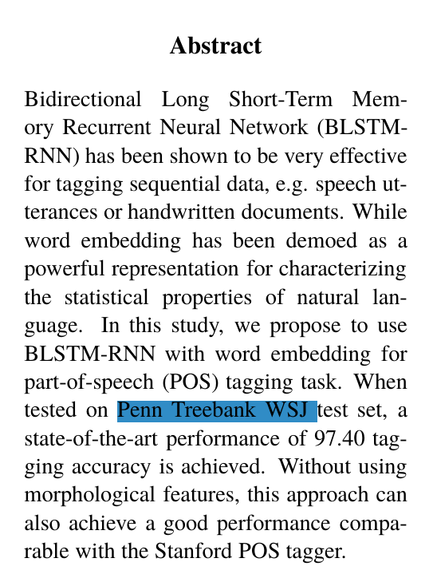
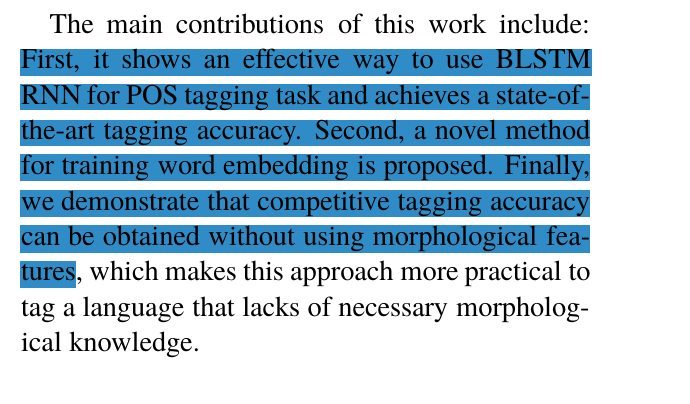
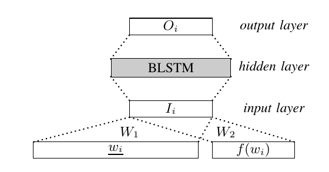
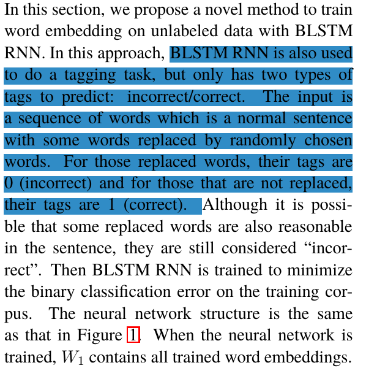
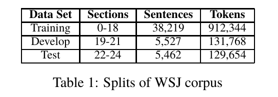
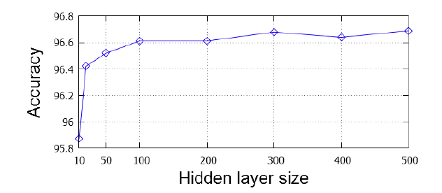
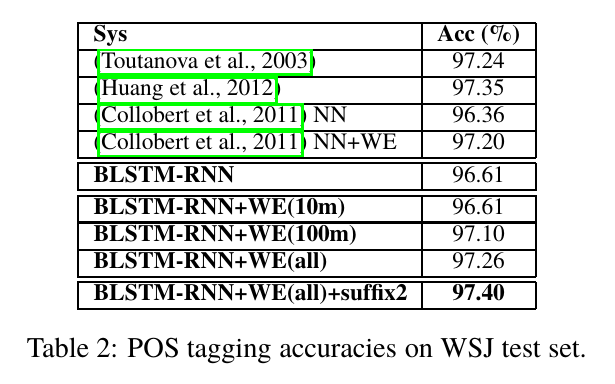
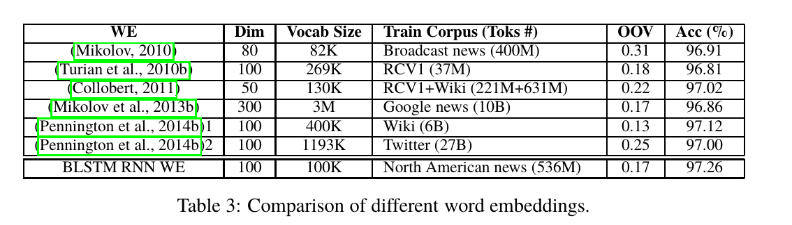

# Part-of-Speech Tagging with Bidirectional Long Short-Term Memory Recurrent Neural Network

## 摘要

​    

​      LSTM对标签数据的任务非常有效,而且字向量是一个强大的表示方法.本论文使用带词嵌入的BLSTM-RNN进行词性标注,在Penn Treebank WSJ 测试集上的准确率达到97.4%

## 介绍

本文的贡献

- BLSTM在词性标注的有效性方法
- 训练词嵌入方法的提出
- 证明了不使用特征也可以获得标记准确性

## 方法

如图, 给我一个句子w1, w2，…y1, y2，…利用BLSTM RNN预测每个单词的标签概率分布。

- $w _i$ 表示当前词one-hot 表示 
- $V$ 是词表
- $f({w} _{i})$ 三维向量,表示判断$w _i$是全小写、全大写还是以大写字母开头

- 整体输入的词向量信息 $I _i = {W} _{1}{w} _{i} + {W} _{2}f({w} _{i})$

- $W _1$被实现查表过程(使用其他预训练词向量)，参考该表中存储的$wi$嵌入词返回${W} _{1} {w} _{i}$
- 词嵌入初始化为均匀分布的随机值，范围从-0.1到0.1.
- 输出层是softmax层，其维度为标记类型的数量。

- 使用反向传播和梯度下降算法进行训练 ${\prod} _{ i\in 1,...n }{ { P } _{ i } ({y} _{i} | {w} _{1}, {w} _{2} ... {w} _{n}) }$
- 输入词$w_i$中最可能的标签${y} _{i}$可以选择为${y} ^{'} _{i} = arg _{ i\in 1,...n } { P } _{ i } ({y} _{i} | {w} _{1}, {w} _{2} ... {w} _{n}) $

## 词向量

​      

​      我们提出了一种新的训练无标记数据嵌入词的方法, 由随机选择的单词代替的正常句子。对于那些被替换的单词，它们的标签是0(不正确)，对于那些没有被替换的单词，它们的标签是1(正确).使二值分类训练

## 实验

BLSTM RNN系统是利用CURRENT实现的，CURRENT是一种采用GPU加速的RNN机器学习库。

### 数据集

使用Penn Treebank标记器1进行标记。一个单词中出现的所有连续字都替换为符号“#”。例如，单词“Tel192”和“Tel6”都被转移到同一个单词“Tel#”上。

### Hidden Layer Size

如图 BLSTM RNN中隐藏层的不同大小与测试集的精确度所示,在精度、模型尺寸和运行时间上保持良好的平衡,100作为Hidden Layer Size

### POS Tagging Accuracies

四个典型的系统作为基线系统 

- Stanford tagger 

- Moore
- Shen et al

- Collobert et al

**BLSTM-RNN**

​    在这个实验中使用的词汇是所有出现在WSJ Penn Treebank训练集的词汇，与北美新闻语料库中最常见的10万个词汇合并，再加上一个“UNK”符号，用来替换所有没有词汇的词汇。

**BLSTM-RNN+WE** 

​     为了构建训练词嵌入的语料库，我们将北美新闻语料库中正常句子中约20%的词替换为随机选取的词。然后训练BLSTM RNN判断哪个词被替换了.

​    表2展示了使用单词嵌入训练北美新闻语料库的前1000万个单词(WE(10m))、前1亿个单词(WE(100m))和所有5.3亿个单词(WE(all))的结果。WE(100m)和WE(all)显著提高了性能。这表明使用更大的未标记数据集可以进一步提高结果。

### Different Word Embeddings

​    在这个实验中，评估了六种已经发布的经过训练的单词嵌入。涉及词的基本信息嵌入和结果在表3列出RCV1代表语料集。OOV(词汇)列表示的单词在词汇外。单词嵌入的用法与实验的BLSTM-RNN+中相同，只是这里的输入层大小等于外部单词嵌入的维数。

   全词嵌入带来更高的精度。然而，尽管训练的语料库较大，OOV率较低，但它们都不能通过增强BLSTM RNN标记来获得高的准确率。实验表明，词性标注方法中，BLSTM RNN训练的词嵌入是必不可少的。

## 总结

​     BLSTM RNN用于词性标注和训练词嵌入。结合在大量未标记数据上训练的单词嵌入，这种方法在不使用丰富的特征的情况下，在华尔街日报测试集上获得了最好的准确性。带单词嵌入的BLSTM RNN有望成为标签任务的有效解决方案.