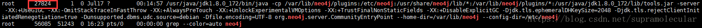

# neo4j

## 安装neo4j

## docker 安装neo4j

1. `docker pull neo4j`
2. `sudo docker run --name neo4j --detach --publish=7474:7474 --publish=7687:7687  --volume=/home/daiyizheng/docker/neo4j/data:/data  --volume=/home/daiyizheng/docker/neo4j/logs:/logs --volume=/home/daiyizheng/docker/neo4j/conf:/conf --volume=/home/daiyizheng/docker/neo4j/import:/import            --env=NEO4J_dbms_memory_pagecache_size=8G  --env=NEO4J_dbms_memory_heap_initial__size=4G --env=NEO4J_dbms_memory_heap_max__size=8G neo4j`

## 非docker 安装


JDK版本：1.8

工具：Xshell6、Xftp6

Neo4j是基于Java的图形数据库，运行Neo4j需要启动JVM进程，因此必须安装JAVA SE的JDK。

下载安装包 http://doc.we-yun.com:1008/neo4j/3.5.20/

liunx环境Neo4j下载地址：http://neo4j.com.cn/topic/5b003eae9662eee704f31cee(社区版免费)

或者直接在服务器上使用命令下载：

 curl -O http://dist.neo4j.org/neo4j-community-3.4.5-unix.tar.gz

2：解压安装

tar -axvf neo4j-community-3.4.5-unix.tar.gz

3:修改配置

在安装目录下找到conf目录下的neo4j.conf文件

修改相应配置如下：

```shell
# 修改第22行load csv时l路径，在前面加个#，可从任意路径读取文件
#dbms.directories.import=import

# 修改35行和36行，设置JVM初始堆内存和JVM最大堆内存
# 生产环境给的JVM最大堆内存越大越好，但是要小于机器的物理内存
dbms.memory.heap.initial_size=5g
dbms.memory.heap.max_size=10g

# 修改46行，可以认为这个是缓存，如果机器配置高，这个越大越好
dbms.memory.pagecache.size=10g

# 修改54行，去掉改行的#，可以远程通过ip访问neo4j数据库
dbms.connectors.default_listen_address=0.0.0.0

# 默认 bolt端口是7687，http端口是7474，https关口是7473，不修改下面3项也可以
# 修改71行，去掉#，设置http端口为7687，端口可以自定义，只要不和其他端口冲突就行
#dbms.connector.bolt.listen_address=:7687

# 修改75行，去掉#，设置http端口为7474，端口可以自定义，只要不和其他端口冲突就行
dbms.connector.http.listen_address=:7474

# 修改79行，去掉#，设置http端口为7473，端口可以自定义，只要不和其他端口冲突就行
dbms.connector.https.listen_address=:7473

# 修改227行，去掉#，允许从远程url来load csv
dbms.security.allow_csv_import_from_file_urls=true

# 修改246行，允许使用neo4j-shell，类似于mysql 命令行之类的
dbms.shell.enabled=true

# 修改235行，去掉#，设置连接neo4j-shell的端口，一般都是localhost或者127.0.0.1，这样安全，其他地址的话，一般使用https就行
dbms.shell.host=127.0.0.1

# 修改250行，去掉#，设置neo4j-shell端口，端口可以自定义，只要不和其他端口冲突就行
dbms.shell.port=1337

# 修改254行，设置neo4j可读可写
dbms.read_only=false
```

4：启动

 进入bin目录执行./neo4j start

进入bin目录执行./neo4j stop

查看图数据库状态

进入bin目录执行./neo4j status

7：客户端访问

http://服务器ip地址:7474/browser/

在浏览器访问图数据库所在的机器上的7474端口（第一次访问账号neo4j，密码neo4j，会提示修改初始密码）


## 错误解决

访问Neo4j验证失败（The client is unauthorized due to authentication failure.）

大概意思就是说服务器验证失败。

如果你有在浏览器上登录不同的neo4j数据库，很可能是由于缓存没有清理掉导致的。
可以试试无痕浏览来访问neo4j的web页面。
另外有还有两种解决方案：

停止neo4j服务，并且删除`data/dbms/auth`，重新启动
修改neo4j.conf配置文件，取消验证机制，修改如下：
`dbms.security.auth_enabled=false`


## neo4j数据库迁移--Neo4j数据库导入导出的方法

Neo4j数据进行备份、还原、迁移的操作时，首先要关闭neo4j;

```
/usr/share/neo4j/bin
neo4j stop
```

如果出现

```
Neo4j not running
```

出现这种情况, Neo4j没有运行, 但是浏览器仍然可以访问neo4j数据库的情况, 直接执行导入数据后,是无法看到导入的数据库,

其实这种情况下Neo4j仍在运行(否则浏览器是无法然访问的),

这就需要强制杀死Neo4j进程,则执行命令 

```
ps -ef|grep neo4j
```

 

```
kill -9 <对应的pid>
```

关闭Neo4j后, 再次用浏览器访问Neo4j,是无法访问的,说明Neo4j是关闭运行了,在此情况下,是可以执行Neo4j的数据导出与导入的.

执行数据导出命令

```
./neo4j-admin  dump --database=graph.db --to=/home/robot/Neoj_data/graph.db.dump
```

执行数据导入命令

```
neo4j-admin load --from=/home/robot/Neoj_data/graph.db.dump --database=graph.db --force  #数据导入
neo4j start		
```

## 导入csv 文件

将文件复制到import 文件夹中

在`http://127.0.0.1:7474/browser/`窗口中执行脚本（注意，数据过大可能报错）

可以在浏览器端或者是neo4j的console下进行这种方式的数据导入，但是这种方式只适用于20M以内的数据导入，对于大量数据是不适用的。

```shell
# node节点
LOAD CSV WITH HEADERS  FROM "file:///node.csv" AS line MERGE (p:Entity{id:line.id,name:line.name})
##查考节点
start n = node(*)
return n
# 关系
LOAD CSV WITH HEADERS FROM "file:///relationship.csv" AS line match (from:Entity{id:line.start_id}),(to:Entity{id:line.end_id})
merge (from)-[r:rel{property1:line.property1,property2:line.property2}]->(to)
```

###  命令行导入

```shell
./neo4j-admin import --database=pkubase.db --nodes "/home/daiyizheng/文档/NLP-NER-projet/CCKS -2020-ckbqa/data/pre-data/node.csv" --relationships "/home/daiyizheng/文档/NLP-NER-projet/CCKS -2020-ckbqa/data/pre-data/relation.csv" --ignore-extra-columns=true --ignore-missing-nodes=true --ignore-duplicate-nodes=true

```


## neo4j 基本操作元素

- neo4j可支持语言：**.NET、Java、Spring、JavaScript、Python、Ruby、PHP、R、Go、C / C++、Clojure、Perl、Haskell**
- 几个专有名词：**变量（标识符）、节点、关系、实体、标签、属性、索引、约束**

## 查 

```sql
## 查的语句有：WHERE语句、ORDER BY 默认是升序，降序添加DESC、LIMIT 返回靠前的一定数目的数据、SKIP 返回靠后的一定数目的数据、UNION 子查询结果合并

## 查询基本结构
MATCH (n:NODENAME) RETURN n 

# LIMIT 
MATCH (n:NODENAME) RETURN n LIMIT 5

# SKIP
MATCH (n:NODENAME) RETURN n SKIP 5
MATCH (n:NODENAME) RETURN n SKIP 1 LIMIT 5

## union
MATCH (pp:Person)
RETURN pp.age,pp.name
UNION
MATCH (cc:Customer)
RETURN cc.age,cc.name

## 查询节点个数：
match(x) return count(x)
## 查询所有的关系类型：
CALL db.relationshipTypes()
## 查询所有的节点标签：
CALL db.labels()
## 查询节点关系种类：
CALL db.schema()
## 查询N层关系的节点：
match q=(x)-[*5..8]-() return q limit 200 这个为查询5到8层关系的
match q=(dh)-[r]-(jq)-[rr]-()-[]-()-[]-()-[]-()-[]-()-[]-() return q limit 400
## 查询节点关系数个数
match(dh:Person)-[r]-(jq:Teacher) with dh, count(r) as dhs where dhs > 2 return dh

## return
返回一个节点：match (n:Node{name:"B"}) return n;
返回一个关系：match (n:Node{name:"A"})-[r:KNOWS]->(c) return r;
返回一个属性：match (n:Node{name:"A"}) return n.name;
返回所有节点：match p=(:Node{name:"A"})-[r]->(b) return *;
列别名： match (a:Node{name:"A"}) return a.age as thisisage;
表达式： match (a:Node:Node{name:"A"}) return a.age >30 ,”literal”,(a)–>();
唯一结果：match (a:Node{name:"A"})–>(b) return distinct b;

## merge-查询
## 在merge子句中指定on match子句
## 如果节点已经存在于数据库中，那么执行on match子句，修改节点的属性；
MERGE (person:Person)
ON MATCH SET person.found = TRUE , person.lastAccessed = timestamp()
RETURN merge子句用于match或create多个关系

## merge子句用于match或create多个关系
MATCH (oliver:Person { name: 'Oliver Stone' }),(reiner:Person { name: 'Rob Reiner' })
MERGE (oliver)-[:DIRECTED]->(movie:Movie)<-[:ACTED_IN]-(reiner)
RETURN movie

集合函数查询
（1）通过id函数，返回节点或关系的ID
MATCH (:Person { name: 'Oliver Stone' })-[r]->(movie)
RETURN id(r);

（2）通过type函数，查询关系的类型
MATCH (:Person { name: 'Oliver Stone' })-[r]->(movie)
RETURN type(r);

（3）通过lables函数，查询节点的标签
MATCH (:Person { name: 'Oliver Stone' })-[r]->(movie)
RETURN lables(movie);

（4）通过keys函数，查看节点或关系的属性键
MATCH (a)
WHERE a.name = 'Alice'
RETURN keys(a)

（5）通过properties()函数，查看节点或关系的属性
CREATE (p:Person { name: 'Stefan', city: 'Berlin' })
RETURN properties(p)

（6）nodes(path)：返回path中节点
match p=(a)-->(b)-->(c) where a.name='Alice' and c.name='Eskil' return nodes(p)

（7）relationships(path)：返回path中的关系
match p=(a)-->(b)-->(c) where a.name='Alice' and c.name='Eskil' return relationships(p)

路径查询
常规路径查询：
MATCH (:Person { name: 'm' })-->(person)
RETURN person;
返回的是:name为m的这个节点，指向的节点，不包括m节点本身

可变长度路径：
match (a:Product {productName:'Chai'} )-[*1..5]-(b:Customer{companyName : 'Frankenversand'}) return a,b
//[*1..5]可变长度路径，从a到b的1-5条路径；

零长度路径
START a=node(3)
MATCH p1=a-[:KNOWS*0..1]->b, p2=b-[:BLOCKS*0..1]->c
RETURN a,b,c, length(p1), length(p2)
这个查询将返回四个路径，其中有些路径长度为0.

最短路径
使用shortestPath函数可以找出一条两个节点间的最短路径，如下。
查询：
START d=node(1), e=node(2)
MATCH p = shortestPath( d-[*..15]->e )
RETURN p
这意味着：找出两点间的一条最短路径，最大关系长度为15.圆括号内是一个简单的路径连接，开始节点，连接关系和结束节点。关系的字符描述像关系类型，最大数和方向在寻找最短路径中都将被用到。也可以标识路径为可选。

最短路径案例一：
MATCH (p1:Person {name:"Jonathan Lipnicki"}),(p2:Person{name:"Joel Silver"}),
p=shortestpath((p1)-[*..10]-(p2))
RETURN p
这里[*..10]表示路径深度10以内查找所有存在的关系中的最短路径关系
最短路径案例二：

MATCH (p1:Person {name:"Jonathan Lipnicki"}),(p2:Person{name:"Joel Silver"}),
p=allshortestpaths((p1)-[*..10]-(p2))
RETURN p
找出所有最短路径

查询关系属性
MATCH (:Person { name: 'matt' })-[r]->( Person) RETURN r,type(r);
功能：查看姓名为matt的人，到标签person之间，关系有哪些

一些特殊的用法：
with用法：with从句可以连接多个查询的结果，即将上一个查询的结果用作下一个查询的开始。
collecty用法：代表把内容序列化
with用法、匿名变量（具体可以见《图数据库》，40P）

（1）匿名变量
(a)<-[:ass]-()-[:bss]->(b)

（2）with用法：

match (a)-[:work]->(b)
with b ORDER BY b.yeah DESC
RETURN a,b

过滤聚合函数的结果：
MATCH (david { name: “David” })–(otherPerson)–>() WITH otherPerson, count(*) AS foaf
WHERE foaf > 1 RETURN otherPerson;

collect前排序结果：
MATCH (n)  WITH n   ORDER BY n.name DESC LIMIT 3  RETURN collect(n.name;

limit搜索路径的分支：
MATCH (n { name: "Anders" })--(m)  WITH m  ORDER BY m.name DESC LIMIT 1  MATCH (m)--(o)  RETURN o.name;

UNWIND
将一个集合展开为一个可选的list，有点像py中的生成器。
//{batch: [{name:"Alice",age:32},{name:"Bob",age:42}]}
UNWIND {batch} as row
CREATE (n:Label)
SET n.name = row.name, n.age = row.age
其中row，就被定义为一个可迭代的List。
案例二：
//{batch: [{from:"alice@example.com",to:"bob@example.com",properties:{since:2012}},{from:"alice@example.com",to:"charlie@example.com",properties:{since:2016}}]}
UNWIND {batch} as row
MATCH (from:Label {from:row.from})
MATCH (to:Label {to:row.to})
CREATE/MERGE (from)-[rel:KNOWS]->(to)
(ON CREATE) SET rel.since = row.properties.since
```


## 创建

```sql
## create-创建节点
create (n:Person { name: 'Robert Zemeckis', born: 1951 }) return n;

## create-创建节点间关系
MATCH (a:Person),(b:Person) 
where a.name = 'm'and b.name = 'Andres' 
CREATE (a)-[r:girl]->(b) 
RETURN r;

## create-创建节点间关系 + 关系属性
MATCH (a:Person),(b:Person)
WHERE a.name = 'm'and b.name = 'Andres' 
CREATE (a)-[r:girl { roles:['friend'] }]->(b)
RETURN r;

##create-创建完整路径path
CREATE p =(vic:Worker:Person{ name:'vic',title:"Developer" })-[:WORKS_AT]->(neo)<-[:WORKS_AT]-(michael:Worker:Person { name: 'Michael',title:"Manager" })
RETURN p
逻辑为：创建vic这个人与变量(neo)的[:WORKS_AT]关系；
创建michael这个人与变量(neo)的[:WORKS_AT]关系

## 创建唯一性节点 CREATE UNIQUE
MATCH (root { name: 'root' }) 
CREATE UNIQUE (root)-[:LOVES]-(someone) 
RETURN someone

##  merge-on create 新增属性
Merge子句的作用有两个：当模式（Pattern）存在时，匹配该模式；当模式不存在时，创建新的模式（参考）。
如果需要创建节点，那么执行on create子句，修改节点的属性
MERGE (keanu:Person { name: 'Keanu Reeves' })
ON CREATE SET keanu.created = timestamp()
RETURN keanu.name, keanu.created
注意：ON CREATE SET只在创建使用有用，如果节点已经存在了，那么该命令失效。
```


##  删除

```sql
大致有两个：DELETE与REMOVE

## 删除所有节点与关系——delete
删除单个节点：MATCH (n:Useless) DELETE n;
删除单个节点和连接它的关系：MATCH (n { name: 'Andres' })-[r]-() DELETE n, r
删除所有节点和关系：MATCH (n) OPTIONAL MATCH (n)-[r]-() DELETE n,r
删除某一类关系：match (n)-[r:created]-() DELETE delete r

## 删除标签与属性——remove
删除属性：MATCH (andres { name: 'Andres' }) REMOVE andres.age RETURN andres;
删除节点的标签：MATCH (n { name: 'Peter' }) REMOVE n:German RETURN n;
删除多重标签：MATCH (n { name: 'Peter' }) REMOVE n:German:Swedish RETURN n

##  重设为NULL——set
删除属性：MATCH (n { name: ‘Andres’ }) SET n.name = NULL RETURN n

```


## 改

```sql
set
节点额外加入标签与属性

// 加入额外标签
match (n)
where id(n)=7
set n:Company
return n;
//加入额外属性
match (n)
where id(n)=100
set n.name = 'id100'
return n;
// 设置多个属性
MATCH (n { name: 'Andres' }) SET n.position = 'Developer', n.surname = 'Taylor'

## 通过set来进行额外加入标签与属性。同时，已有的关系可以通过set赋值上去。
在节点和关系之间复制属性：
MATCH (at { name: 'Andres' }),(pn { name: 'Peter' }) 
SET at = pn 
RETURN at, pn;

## merge-on match
MERGE (person:Person)
ON MATCH SET person.found = TRUE , person.lastAccessed = timestamp()
RETURN person.name, person.found, person.lastAccessed
```


## 统计与集合函数

```sql
统计函数
常见的有：abs()，acos()，asin()，atan()，atan2(x,y)，cos()，cot()，degree()，e()返回一个常量，exp(2) e的二次方，floor(0.9)=0.0，
haversin()，log()，log10()，pi()常量PI，radians(180)，rand()返回0到1.0的值，round(3.14)=3.0，sign()，sin()，sqrt()，tan()
count：MATCH (n { name: ‘A’ })–>(x) RETURN n, count(*)
sum：MATCH (n:Person) RETURN sum(n.property)
avg：MATCH (n:Person) RETURN avg(n.property)
percentileDisc：计算百分位。MATCH (n:Person) RETURN percentileDisc(n.property, 0.5)
percentileCont：MATCH (n:Person) RETURN percentileCont(n.property, 0.4)
stdev：计算标准偏差。MATCH (n) WHERE n.name IN [‘A’, ‘B’, ‘C’] RETURN stdev(n.property)
stdevp：MATCH (n) WHERE n.name IN [‘A’, ‘B’, ‘C’] RETURN stdevp(n.property)
max：MATCH (n:Person) RETURN max(n.property)
min：MATCH (n:Person) RETURN min(n.property)
collect：MATCH (n:Person) RETURN collect(n.property)
distinct：MATCH (a:Person { name: ‘A’ })–>(b) RETURN
coalesce：返回第一个not null值。match (a) where a.name=’Alice’ return coalesce(a.hairColor,a.eyes)
head：返回集合的第一个元素。match (a) where a.name=’Alic’ return a.array,head(a.array);
last：返回集合的最后一个元素。match (a) where a.name=’Alic’ return a.array,last(a.array);
timestamp：返回当前时间的毫秒
startNode：返回一个关系的开始节点。match (x:foo)-[r]-() return startNode(r);
endNode：返回一个关系的结束节点。match (x:foo)-[r]-() return endNode(r);
toInt,toFloat,toString
```


## py2neo

```python
from py2neo import Node, Relationship, Graph, NodeMatcher

"""1 创建节点与关系"""
a = Node("Person", name="Alice")
b = Node("Person", name="Bob")
ab = Relationship(a, "KNOWS", b)

## 节点添加属性
a['age'] = 20
b['age'] = 34
ab['time'] = '2027/08/31'

## 通过 setdefault() 方法赋值默认属性
a.setdefault('location', 'beijing')

## update批量更新
data = {
    'name': "Amy",
    "age" : 22
}
a.update(data)
# print(a.labels, b, ab)
## 节点其他属性
"""
  - hash 
  - node[key]
  - node[key] = value
  - del node[key] 
  - len(node)
  - dict(node)
  - wake(node)
  - labels
  - has_label("label")
  - add_label("label")
  - remove_label('label')
  - clear_labels()
  - update_labels('iter_label')
"""
## 连接的属性
"""
  - hash(relationship)
  - relationship[key]
  - relationship[key] = value
  - del relationship[key]
  - len(relationship)
  - dict(relationship)
  - walk(relationship)
  - type()

"""


"""2 子图Subgraphs"""
s = a | b | ab
s1 = a | b | ab
s2 = a | b
print(s1 & s2)

"""3 Walkable Types"""
a = Node('Person', name='Alice')
b = Node('Person', name='Bob')
c = Node('Person', name='Mike')
ab = Relationship(a, "KNOWS", b)
ac = Relationship(a, "KNOWS", c)
w = ab + Relationship(b, "LIKES", c) + ac
## 遍历
for i in w:
    print(i)

## 其他属性
print(w.start_node)
print(w.end_node)
print(w.nodes)
print(w.relationships)

"""4 连接已有图数据库 - .Graph()"""
graph = Graph("http://localhost:7474",  username="neo4j",  password="123456") # test_graph,就连接上了电脑中默认的图数据库，就可以进行查询了。

##利用 create() 方法传入 Subgraph 对象来将关系图添加到数据库

# graph.create(s)

## 单独添加单个 Node 或 Relationship
# graph.create(a)
# graph.create(b)
# graph.create(ab)

"""其他应用"""
## 查找是否存在节点 - exists(subgraph)
print(graph.exists(s))

"""二、查询方式"""
"""2.1 结果查询-.run/.data/.match"""
## 比较传统的方式：通过nodes的ID进行检索
# 其中的数字对应的是节点，ID
# 这个ID不按顺序来的，要注意
graph.nodes[1234]
graph.nodes.get(1234)

## match的方式
data = graph.run("MATCH (a:Person {name:'Alice'}) return a").data()
data1 = graph.run("MATCH (a:Person {name:'Alice'}) -[b:KNOWS]-> (c:Person {name:'Bob'}) return a, b, c").data()

## graph.run()，之中填写的是查询语句。查询的结果也可以转换为dataframe的格式 查询出来的结果是dict/list格式的，并不是graph型，于是不能进行后续查询
import pandas as pd
df = pd.DataFrame(data1)

## 标准化成一些表格的格式
df1 = graph.run("MATCH (a:Person {name:'Alice'}) return a").data()  # list型
df2 = graph.run("MATCH (a:Person {name:'Alice'}) return a").to_data_frame()  # dataframe型
df3 = graph.run("MATCH (a:Person {name:'Alice'}) return a").to_table()  # table

"""更灵活的查询 - NodeMatcher"""
selector = NodeMatcher(graph)
nodematch = selector.match("Person")
print(list(nodematch))
#另外也可以使用 where() 进行更复杂的查询，例如查找 name 是 A 开头的 Person Node，实例如下：
nodematch1 = list(selector.match("Person").where("_.name =~ 'B.*'", "1960 <= _.born < 1970"))
print(nodematch1)
persons = selector.match('Person').where("_.name =~ 'B.*'")
print(list(persons))
## 另外也可以使用 order_by() 进行排序：
persons = selector.match('Person').order_by('_.age')
print(list(persons))
"""
first()返回单个节点
limit(amount)返回底部节点的限值条数
skip(amount)返回顶部节点的限值条数
order_by(*fields)排序
where(*conditions, **properties)筛选条件
"""

"""2.4 match() 或 match_one() 查找Relationship
match 匹配关系
.match_one，匹配并返回所有满足条件的一条关系
"""
nodematcher=NodeMatcher(graph)
findnode=nodematcher.match('Person').first()
# p = graph.match(nodes=(findnode,), r_type='KNOWS')
# print(list(p))

# graph.match_one(nodes=(findnode,), r_type='KNOWS')

""" 删除 - .delete()/.delete_all()"""
s = graph.match()
# graph.delete(findnode)
# graph.delete_all()

```


## 参考

[neo4j︱图数据库基本概念、操作罗列与整理（一）](https://blog.csdn.net/sinat_26917383/article/details/79883503)

[neo4j︱Cypher 查询语言简单案例（二）](https://blog.csdn.net/sinat_26917383/article/details/79850412)

[neo4j︱Cypher完整案例csv导入、关系联通、高级查询（三）](https://blog.csdn.net/sinat_26917383/article/details/79852596)

[neo4j︱与python结合的py2neo使用教程（四）](https://blog.csdn.net/sinat_26917383/article/details/79901207)

[Py2neo v4 使用笔记](https://www.yuque.com/yahan/mztcmb/lszfiv)