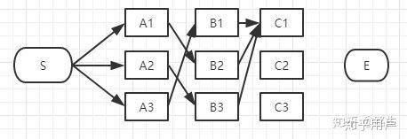

这一片博客通俗易懂，我这边直接拿过来了

转载至　https://www.zhihu.com/question/20136144

# 维特比算法


​     viterbi维特比算法解决的是篱笆型的图的最短路径问题，图的节点按列组织，每列的节点数量可以不一样，每一列的节点只能和相邻列的节点相连，不能跨列相连，节点之间有着不同的距离，距离的值就不在图上一一标注出来了，大家自行脑补

答案：viterbi (维特比)算法。

过程非常简单：

为了找出S到E之间的最短路径，我们先从S开始从左到右一列一列地来看。

首先起点是S，从S到A列的路径有三种可能：S-A1、S-A2、S-A3，如下图：


​    我们不能武断地说S-A1、S-A2、S-A3中的哪一段必定是全局最短路径中的一部分，目前为止任何一段都有可能是全局最短路径的备选项。

   我们继续往右看，到了B列。按B列的B1、B2、B3逐个分析。

先看B1：


如上图，经过B1的所有路径只有3条：

S-A1-B1

S-A2-B1

S-A3-B1

以上这三条路径，各节点距离加起来对比一下，我们就可以知道其中哪一条是最短的。假设S-A3-B1是最短的，那么我们就知道了经过B1的所有路径当中S-A3-B1是最短的，其它两条路径路径S-A1-B1和S-A2-B1都比S-A3-B1长，绝对不是目标答案，可以大胆地删掉了。删掉了不可能是答案的路径，就是viterbi算法（维特比算法）的重点，因为后面我们再也不用考虑这些被删掉的路径了。现在经过B1的所有路径只剩一条路径了，如下图：


接下来，我们继续看B2：


同理，如上图，经过B2的路径有3条：

S-A1-B2

S-A2-B2

S-A3-B2

这三条路径中，各节点距离加起来对比一下，我们肯定也可以知道其中哪一条是最短的，假设S-A1-B2是最短的，那么我们就知道了经过B2的所有路径当中S-A1-B2是最短的，其它两条路径路径S-A2-B2和S-A3-B1也可以删掉了。经过B2所有路径只剩一条，如下图：


接下来我们继续看B3：


同理，如上图，经过B3的路径也有3条：

S-A1-B3

S-A2-B3

S-A3-B3

这三条路径中我们也肯定可以算出其中哪一条是最短的，假设S-A2-B3是最短的，那么我们就知道了经过B3的所有路径当中S-A2-B3是最短的，其它两条路径路径S-A1-B3和S-A3-B3也可以删掉了。经过B3的所有路径只剩一条，如下图：


现在对于B列的所有节点我们都过了一遍，B列的每个节点我们都删除了一些不可能是答案的路径，看看我们剩下哪些备选的最短路径，如下图：


上图是我们删掉了其它不可能是最短路径的情况，留下了三个有可能是最短的路径：S-A3-B1、S-A1-B2、S-A2-B3。现在我们将这三条备选的路径放在一起汇总到下图：


S-A3-B1、S-A1-B2、S-A2-B3都有可能是全局的最短路径的备选路径，我们还没有足够的信息判断哪一条一定是全局最短路径的子路径。

   如果我们你认为没毛病就继续往下看C列，如果不理解，回头再看一遍，前面的步骤决定你是否能看懂viterbi算法（维特比算法）。

​    接下来讲到C列了，类似上面说的B列，我们从C1、C2、C3一个个节点分析。

经过C1节点的路径有：

S-A3-B1-C1、S-A1-B2-C1、S-A2-B3-C1




和B列的做法一样，从这三条路径中找到最短的那条（假定是S-A3-B1-C1），其它两条路径同样道理可以删掉了。那么经过C1的所有路径只剩一条，如下图：


同理，我们可以找到经过C2和C3节点的最短路径，汇总一下：


到达C列时最终也只剩3条备选的最短路径，我们仍然没有足够信息断定哪条才是全局最短。

最后，我们继续看E节点，才能得出最后的结论。

到E的路径也只有3种可能性：


E点已经是终点了，我们稍微对比一下这三条路径的总长度就能知道哪条是最短路径了。


在效率方面相对于粗暴地遍历所有路径，viterbi 维特比算法到达每一列的时候都会删除不符合最短路径要求的路径，大大降低时间复杂度。

## 公式推导

我们首先定义一个变量


这个v_t(j)表示的是我们看到了前 t 个 观测值，通过了t-1个能够取得最大概率的隐状态，且第t个状态值为j的概率值。

与forward算法类似，v_{t-1}与v_t之间也存在着某种递推关系。


其中 a_{ij} 表示从隐状态i 到 隐状态 j的转换概率, b_j(o_t)表示从隐状态 j 生成观测值 o_t 的概率。

$max _ {j=1} ^N v _T(j) $

初始化


bt: backtrack,一张二维表格，记录了当前位置的上一个隐状态的值。

递推公式


最终结果


##  注意    

​       很多人都用隐马尔科夫模型来回答viterbi算法，其实viterbi算法只是解决隐马第三个问题（求观察序列的最可能的标注序列）的一种实现方式。这个问题可以用于viterbi算法实现，也可以用其他方式实现（如穷举法）；而viterbi算法可以用于解决隐马第三问题，也可以用于解决其他问题。所以千万不要把viterbi算法和隐马尔科夫模型等价了。

​       viterbi算法其实就是多步骤每步多选择模型的最优选择问题，其在每一步的所有选择都保存了前续所有步骤到当前步骤当前选择的最小总代价（或者最大价值）以及当前代价的情况下前继步骤的选择。依次计算完所有步骤后，通过回溯的方法找到最优选择路径。符合这个模型的都可以用viterbi算法解决，隐马模型的第三问题刚好符合这个模型，所以才采用了viterbi算法。


## 代码

```python
def run_viterbi(emission_scores, trans_scores, start_scores, end_scores):
    """Run the Viterbi algorithm.

    N - number of tokens (length of sentence)
    L - number of labels

    As an input, you are given:
    - Emission scores, as an NxL array
    - Transition scores (Yp -> Yc), as an LxL array
    - Start transition scores (S -> Y), as an Lx1 array
    - End transition scores (Y -> E), as an Lx1 array

    You have to return a tuple (s,y), where:
    - s is the score of the best sequence
    - y is the size N array/seq of integers representing the best sequence.
    """
    L = start_scores.shape[0]
    assert end_scores.shape[0] == L
    assert trans_scores.shape[0] == L
    assert trans_scores.shape[1] == L
    assert emission_scores.shape[1] == L
    N = emission_scores.shape[0]

    y = []
    ## start
    scores = 0.0 + start_scores.reshape((L, 1)) # L x 1 
    prevs = []
    for i in range(N-1):
        emit_scores = emission_scores[i].reshape((L, 1)) # L x 1　
        scores = scores + emit_scores + trans_scores # L x L t-1状态的全部分量＋当前t时刻的发射状态＋从t-１转移到t状态的值

        prevs.append(scores.argmax(0))
        scores = scores.max(0).reshape((L, 1)) # L x 1 
    
    scores = (scores.reshape((L, 1)) + end_scores.reshape((L, 1)) + emission_scores[N-1].reshape((L, 1))).reshape((L)) # L ＃　最后的scores 
    
    y = [scores.argmax()] ## 求最后位置的最大值索引
    score = scores.max()## 求最后位置的最大值
       
    for indices in prevs[::-1]:##倒叙从最后一个回溯最优的路径
        last_index = y[0]
        new_index = indices[last_index]
        y = [new_index] + y
    
    return [score, y]
```

```python
def run_viterbi_test():
    """A simple tester for Viterbi algorithm.

    This function generates a bunch of random emission and transition scores,
    and computes the best sequence by performing a brute force search over all
    possible sequences and scoring them. It then runs Viterbi code to see what
    is the score and sequence returned by it.

    Compares both the best sequence and its score to make sure Viterbi is correct.
    """
    from viterbi import run_viterbi
    from numpy import random
    import numpy as np
    from itertools import product

    maxN = 7 # maximum length of a sentence (min is 1)
    maxL = 4 # maximum number of labels (min is 2)
    num_tests = 1000 # number of sentences to generate
    random.seed(0)
    tolerance = 1e-5 # how close do the scores have to be?

    emission_var = 1.0 # variance of the gaussian generating emission scores
    trans_var = 1.0 # variance of the gaussian generating transition scores

    passed_y = 0 # how many times the correct sequence was predicted
    passed_s = 0 # how many times the correct score was returned

    for t in range(num_tests):
        N = random.randint(1, maxN+1)
        L = random.randint(2, maxL+1)

        # Generate the scores
        emission_scores = random.normal(0.0, emission_var, (N,L))
        trans_scores = random.normal(0.0, trans_var, (L,L))
        start_scores = random.normal(0.0, trans_var, L)
        end_scores = random.normal(0.0, trans_var, L)

        # run viterbi
        (viterbi_s,viterbi_y) = run_viterbi(emission_scores, trans_scores, start_scores, end_scores)
        # print "Viterbi", viterbi_s, viterbi_y

        # compute the best sequence and score
        best_y = []
        best_s = -np.inf
        for y in product(range(L), repeat=N): # all possible ys
            # compute its score
            score = 0.0
            score += start_scores[y[0]]
            for i in range(N-1):
                score += trans_scores[y[i], y[i+1]]
                score += emission_scores[i,y[i]]
            score += emission_scores[N-1,y[N-1]]
            score += end_scores[y[N-1]]
            # update the best
            if score > best_s:
                best_s = score
                best_y = list(y)
        # print "Brute", best_s, best_y

        # mismatch if any label prediction doesn't match
        match_y = True
        for i in range(len(best_y)):
            if viterbi_y[i] != best_y[i]:
                match_y = False
        if match_y: passed_y += 1
        # the scores should also be very close
        if abs(viterbi_s-best_s) < tolerance:
            passed_s += 1

    print("Passed(y)", passed_y*100.0/num_tests)
    print("Passed(s)", passed_s*100.0/num_tests)
    assert passed_y == num_tests
    assert passed_s == num_tests


if __name__ == "__main__":
    run_viterbi_test()
```

