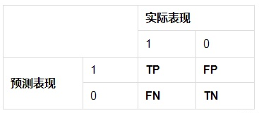

# 准确率、精确率、召回率、F1-score

​      机器学习问题之中，通常需要建立模型来解决具体问题，但对于模型的好坏，也就是模型的泛化能力，如何进行评估呢?

## 混淆矩阵

如上图所示，要了解各个评价指标，混淆矩阵中的 P 表示 Positive，即正例或者阳性，N 表示 Negative，即负例或者阴性。你也可以把 P 和 N 分别理解为二分类中的 1-0

- TP：预测为1，实际为1，预测正确。
- FP：预测为1，实际为0，预测错误。
- FN：预测为0，实际为1，预测错误。
- TN：预测为0，实际为0，预测正确。

- TP+FP：表示所有预测为正的样本数量
- TN+FN：表示所有预测为负的样本数量
- TP+FN：表示实际为正的样本数量
- TN+FP：表示实际为负的样本数量

## 准确率（accuracy）

所有的预测正确（正类负类）的占总的比重

$Accuracy = \frac {TP+TN}{TP+TN+FP+FN}$

##  精确率（也叫查准率，precision)

即正确预测为正的占全部预测为正的比例，（真正正确的占所有预测为正的比例）

$Precision = \frac {TP}{TP+FP}$

## 召回率（recall）

即正确预测为正的占全部实际为正的比例（真正正确的占所有实际为正的比例）

$ Recall = \frac {TP}{TP+ FN}$ 

## F1-score

F1值为算数平均数除以几何平均数，且越大越好，将Precision和Recall的上述公式带入会发现，当F1值小时，True Positive相对增加，而false相对减少，即Precision和Recall都相对增加，即F1对Precision和Recall都进行了加权。

$\frac {2}{F _1} = \frac{1}{Precision} + \frac {1}{Recall}$

$F1 = \frac {2TP}{2TP+FP+ FN}$

## 各指标优缺点

> 准确率 样本不均衡的情况下,并不能作为好的指标
>
> 精确率 针对预测结果而言  
>
> 召回率 是针对原样本而言,准确率和召回率互相影响,相互牵制.
>
> F1  是精确率和召回率的调和平均。引入F1-Score作为综合指标，就是为了平衡准确率和召回率的影响

## 参考

[参考1](https://blog.csdn.net/Joseph__Lagrange/article/details/90813885)