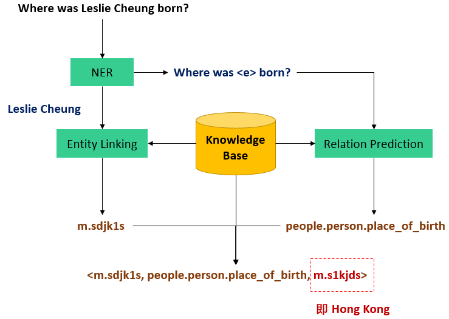

# 知识问答KBQA

## 问题描述

​    基于知识图谱的自动问答（Question Answering over Knowledge Base, 即 KBQA）问题的大概形式是，预先给定一个知识库（比如Freebase），知识库中包含着大量的先验知识数据，然后利用这些知识资源自动回答自然语言形态的问题（比如“肉夹馍是江苏的美食吗”，“虵今年多大了”等人民群众喜闻乐见的问题）。

##  什么是知识库

以知识为主要单位，实体为主要载体。一般来说，知识（或者事实）主要以三元组形式呈现：<头实体，关系，尾实体>，其中实体即人、地点、或特定概念等万物。举例来说，<虵，改变了，中国> 就是一条简单的三元组示例，其中头尾皆为知识库中固有的实体单元。

## 方法框架

对着图说：假设要回答“Where was Leslie Cheung born”这个问题，主要分四步：

1. **实体识别（Named Entity Recognition）**，即把问题中的主要实体的名字从问题中抽出来，这样才知道应该去知识库中搜取哪个实体的信息来解决问题，即图中把“Leslie Cheung”这个人名抽出来；
2. **实体链接（Entity Linking）**，把抽取出来的实体名和知识库中具体的实体对应起来，做这一步是因为，由于同名实体的存在，名字不是实体的唯一标识，实体独一无二的编号（id）才是，找到了实体名没卵用，必须要对应到知识库中具体的实体id，才能在知识库中把具体实体找到，获取相关信息。即图中将“Leslie Cheung”映射到“m.sdjk1s”这个 id 上（Freebase 的实体 id 是这个格式的）。这一步会存在一些问题，比如直接搜“姓名”叫“Leslie Cheung”的实体是搜不到的，因为“Leslie Cheung”其实是某个实体的“外文名”，他的“姓名”叫“张国荣”，以及有时候还会有多个叫“Leslie Cheung”的人。具体解决方式后面再说。
3. **关系预测（Relation Prediction），**根据原问句中除去实体名以外的其他词语预测出应该从知识库中哪个关系去解答这个问题，**是整个问题中最主要的一步**。即图中从“Where was <e> born”预测出“people.person.place_of_birth”（Freebase 的关系名格式，翻译过来就是“出生地”）这个关系应该连接着问题的主要实体“Leslie Cheung”与这个问题的答案。
4. **找到了实体与关系**，直接在知识库中把对应的三元组检索出来，即 “<m.sdjk1s,
   people.person.place_of_birth, m.s1kjds>”，那么这条三元组的尾实体，即“m.s1kjds”就是问题的答案，查询其名字，就是“Hong Kong”。

> KBQA 的解决方法有两个方向
>
> 1. 通过逻辑表达式直接生成 SPARQL（数据库查询语言，类似 SQL 那种）查数据库
> 2. 就是按上面说的框架那四步，也是按照这个框架来做